LineMessagingApiNote
===

どこもかしこもわかりづらいサイトばっかりだった。ちゃんとまとめる。

## LINE Developers でチャネルを作成

この作業をしているとき「Line Developers」と「Line for business」がややこしい。どちらにも「チャネル」に相当するものがあるから。

- Line Developers: [https://developers.line.biz/](https://developers.line.biz/)
- Line for business: [https://manager.line.biz/](https://manager.line.biz/)

そして「チャネル」「プロバイダ」あたりの用語もややこしい。プロバイダがチャネルの親にあたる。ひとつのプロバイダに対し複数のチャネルを作成できる。チャネルが、 LINE の対話相手になる。


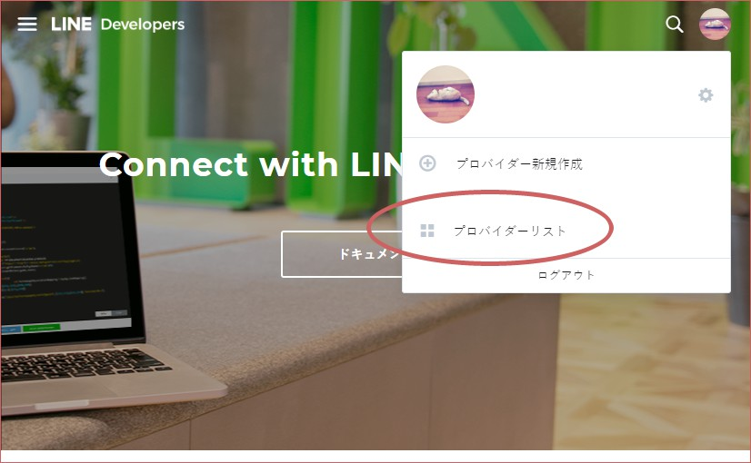

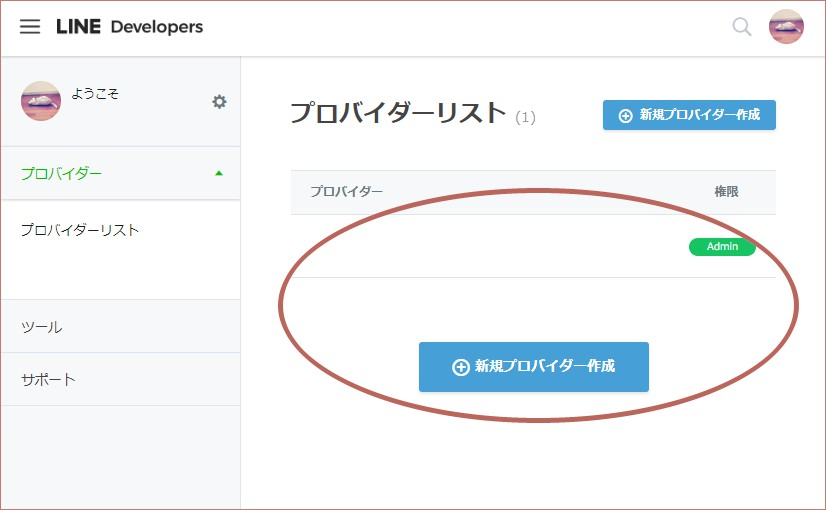

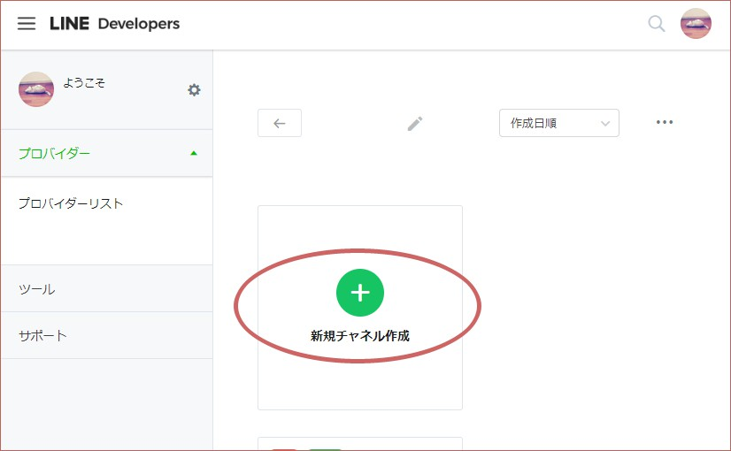

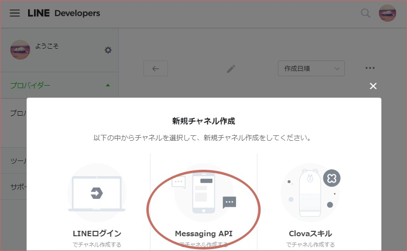

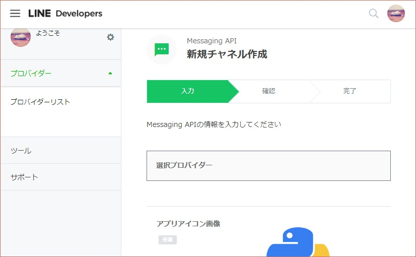

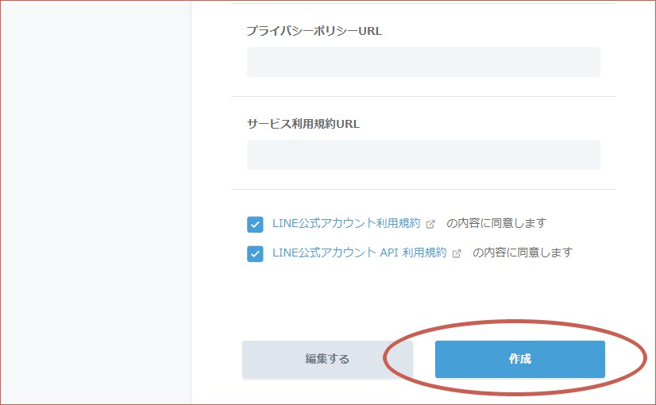

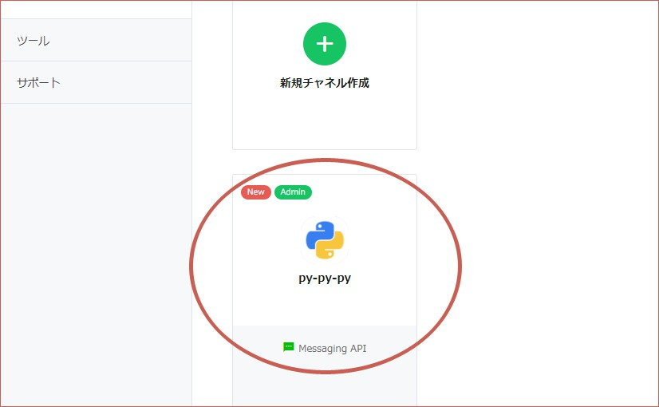

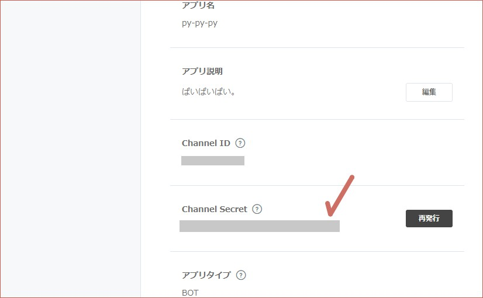

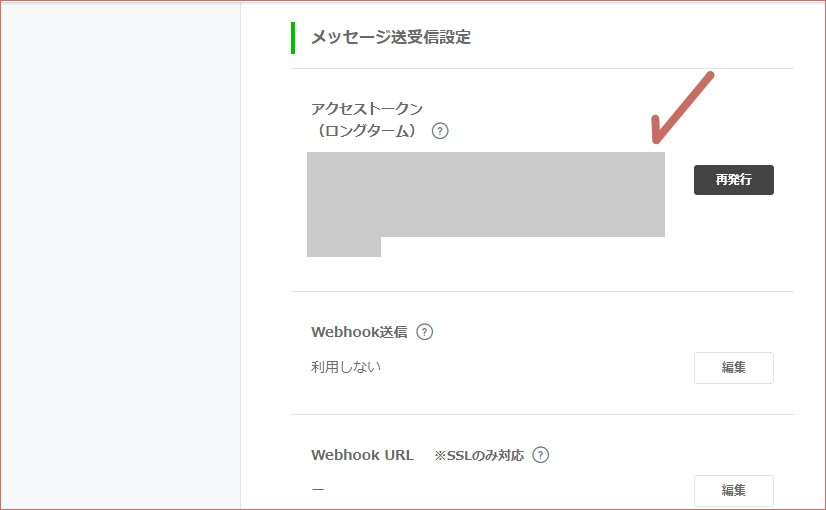

## Python スクリプト作成

ぼくの場合、 pipenv を使うので。

```bash
pipenv install flask line-bot-sdk gunicorn
pipenv shell
```

Python スクリプトは my_flask_script.py って名前にしてみた。

```python
from flask import Flask, request, abort
import os
from linebot import LineBotApi, WebhookHandler
from linebot.exceptions import InvalidSignatureError
from linebot.models import MessageEvent, TextMessage, TextSendMessage

app = Flask(__name__)

# Get from environment variables.
CHANNEL_ACCESS_TOKEN = os.environ['CHANNEL_ACCESS_TOKEN']
CHANNEL_SECRET = os.environ['CHANNEL_SECRET']

line_bot_api = LineBotApi(CHANNEL_ACCESS_TOKEN)
handler = WebhookHandler(CHANNEL_SECRET)


@app.route('/')
def top_page():
    return 'Here is root page.'


@app.route('/callback', methods=['POST'])
def callback_post():
    # get X-Line-Signature header value
    signature = request.headers['X-Line-Signature']

    # get request body as text
    body = request.get_data(as_text=True)
    app.logger.info('Request body: ' + body)

    # handle webhook body
    try:
        handler.handle(body, signature)
    except InvalidSignatureError:
        abort(400)

    return 'OK'


@handler.add(MessageEvent, message=TextMessage)
def handle_message(event):
    line_bot_api.reply_message(
        event.reply_token,
        TextSendMessage(text='こちらこーるばっく処理からお送りします:'+event.message.text))


if __name__ == '__main__':
    app.run()
```

## Heroku 用ファイル作成

```bash
# runtime.txt: Python のバージョンを記載。
echo python-3.7.4 > runtime.txt

# requirements.txt: 依存ライブラリの記載。
pip freeze > requirements.txt

# Procfile: プログラムの実行方法を記載。
echo web: gunicorn my_flask_script:app --log-file - > Procfile
```

## Heroku へアップ

```bash
# Git リポジトリ作成。
git init
# 個人的な趣味で、最初に空っぽのコミットを作成。
git commit --allow-empty -m "Initial Commit"
# 全ファイルをコミット。
git add --all
git commit -m "Add all files"

# 今回のアプリ名は line-messaging-py-py-py にしてみる。
heroku create line-messaging-py-py-py

# 環境変数を設定。
heroku config:set CHANNEL_ACCESS_TOKEN="チャネル基本設定のページからアクセストークン（ロングターム）をコピーしてくる" --app line-messaging-py-py-py
heroku config:set CHANNEL_SECRET="チャネル基本設定のページから Channel Secret をコピーしてくる" --app line-messaging-py-py-py

# Heroku のリポジトリへアップ。
git push heroku master

# 途中でなにか失敗したら一度消す。
heroku apps:destroy --app line-messaging-py-py-py
```

トップページのメソッドも作ってあるので、確認してみる。

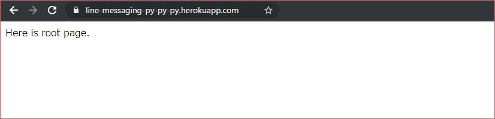


## Heroku URL を Webhook URL として LINE Developers へ登録

チャネル基本設定のページで Webhook URL を登録し、 Webhook送信 を有効にする。上の Python スクリプトで、 callback を受け付ける URL は `/callback` にしたので、今回の Webhook URL は `https://line-messaging-py-py-py.herokuapp.com/callback` になる。

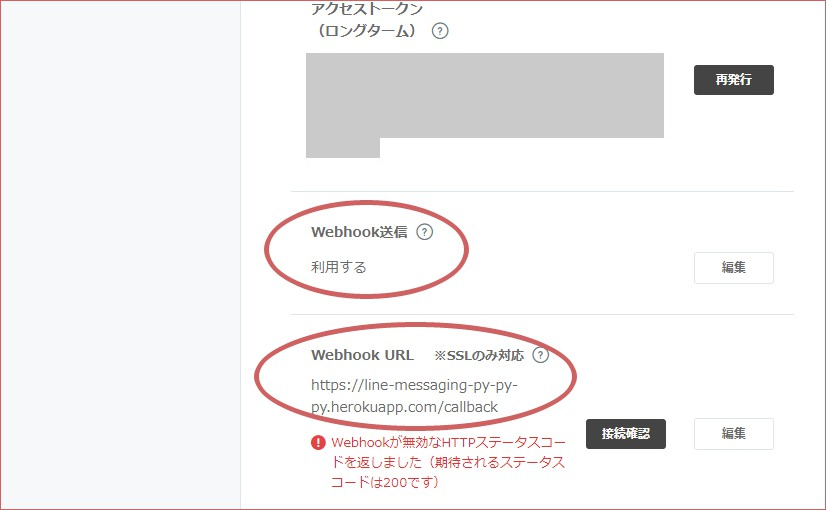


## 使う

チャネル基本設定のページの下の方に QR コードがあるので、そこからこのチャネルを友達登録する。

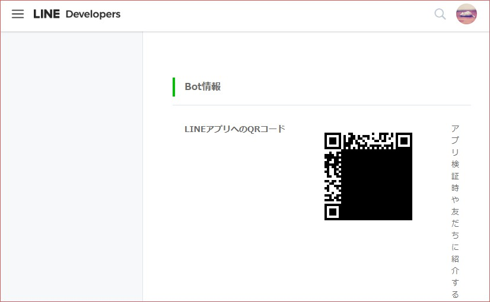

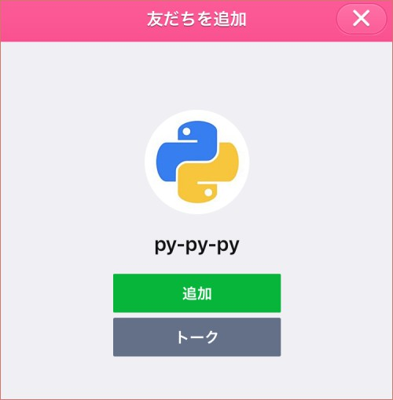

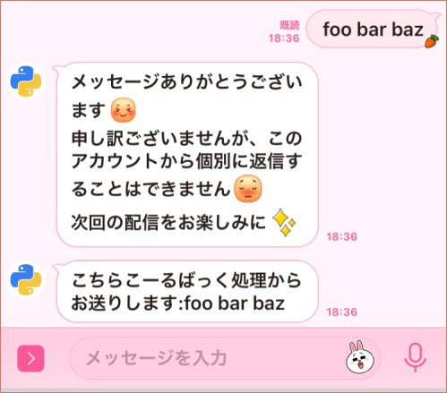

Python で書いたコールバック処理を通過してメッセージが返されたことがわかる。いまはチャネルの設定がデフォルトなので色々自動返信されちゃっているけれど、それはのちのち編集したらいい。


## push_message を使う

上で書いた Python スクリプトだけでは、返事しかできない。そうではなく、サーバ側から能動的にメッセージを送れるようにしたいところ。上の `handle_message` メソッドを以下のように書き換える。

```python
@handler.add(MessageEvent, message=TextMessage)
def handle_message(event):
    # userId を取得。
    user_id = event.source.user_id

    # reply のテスト。
    line_bot_api.reply_message(
        event.reply_token,
        TextSendMessage(text='こちらこーるばっく処理からお送りします:'+event.message.text))

    # push のテスト。 userId を保存しておけば、いつでもユーザへメッセージを送れる。
    line_bot_api.push_message(
        user_id,
        TextSendMessage(text='ぷっしゅめっせーじです。'))
```

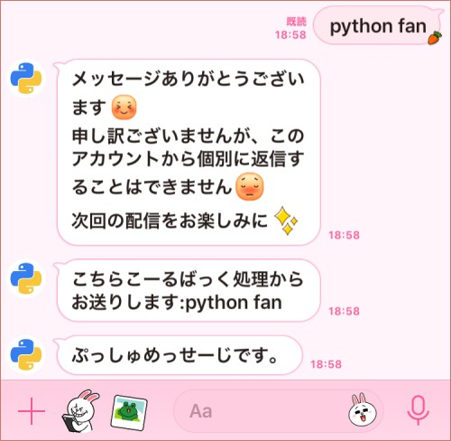

まあ、この作りでは結局返事をしているだけなのだけれど、ユーザごとにユニークである `user_id` を保存しておきさえすればサーバ側からいつでもメッセージを送付することができることがわかる。
