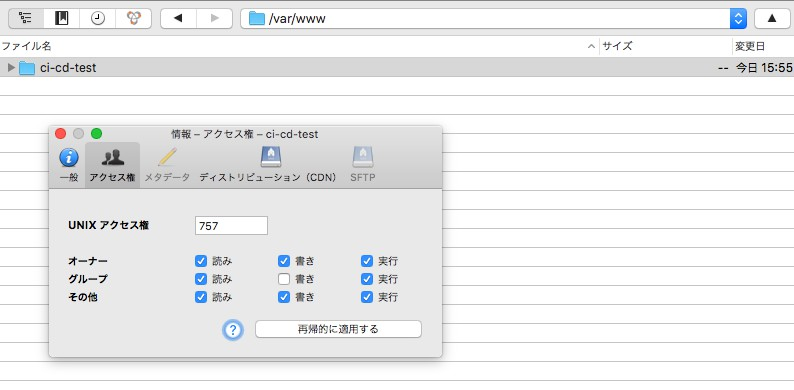
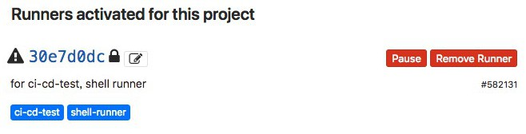
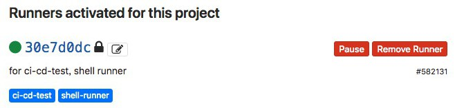
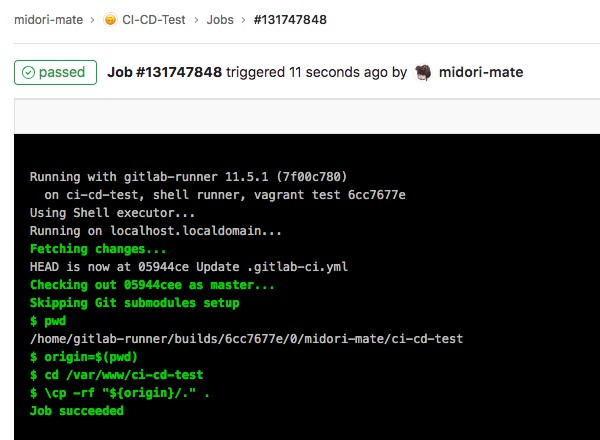
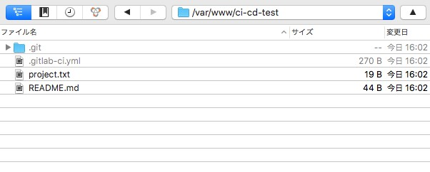

GitLab Deploy Note
===

## 目標

GitLab の **master ブランチに push したら自動的にサーバにアップされる** ようにする。

- Repository: `https://gitlab.com/midori-mate/ci-cd-test`
- Server: GCP で借りてるサーバ。 ローカルの virtualbox でも試したけどうまくいった。 デプロイはサーバの `/var/www/ci-cd-test/` の中へ行う。


## 1. デプロイ先のディレクトリの準備

権限は開けとかないとダメよ。




## 2. リポジトリの token をコピー

`Setting > CI/CD > Runners` の `Use the following registration token during setup` ってとこ。


## 3. GitLab CI Runner インストール

サーバのほうで

```bash
# 一気に実行したいとき用。
sudo wget -O /usr/local/bin/gitlab-runner https://gitlab-runner-downloads.s3.amazonaws.com/latest/binaries/gitlab-runner-linux-amd64
sudo chmod +x /usr/local/bin/gitlab-runner
sudo useradd --comment 'GitLab Runner' --create-home gitlab-runner --shell /bin/bash
sudo /usr/local/bin/gitlab-runner install --user=gitlab-runner --working-directory=/home/gitlab-runner
sudo /usr/local/bin/gitlab-runner start
sudo /usr/local/bin/gitlab-runner status
```

```bash
# 解説

# 32bit なのか 64bit なのか
$ uname -a

# X86_64 って表示されたから 64bit らしいぞ! その場合このバイナリを DL。
$ sudo wget -O /usr/local/bin/gitlab-runner https://gitlab-runner-downloads.s3.amazonaws.com/latest/binaries/gitlab-runner-linux-amd64

# gitlab runner の実行権限を与えます。
$ sudo chmod +x /usr/local/bin/gitlab-runner

# runner を実行するユーザを作成します。
$ sudo useradd --comment 'GitLab Runner' --create-home gitlab-runner --shell /bin/bash

# 作ったユーザを実行者として runner をインストールします。
$ sudo /usr/local/bin/gitlab-runner install --user=gitlab-runner --working-directory=/home/gitlab-runner

# 起動しておきます。
$ sudo /usr/local/bin/gitlab-runner start

# 起動確認です。
$ sudo /usr/local/bin/gitlab-runner status
```


## 4. Runner を作ってリポジトリに登録

```bash
$ sudo /usr/local/bin/gitlab-runner register
```

そうすると色々連続で聞かれるから、以下のように入力していく。

|                      聞かれること                      |            答え方            |
|--------------------------------------------------------|------------------------------|
| Please enter the gitlab-ci coordinator URL             | https://gitlab.com/          |
| Please enter the gitlab-ci token for this runner       | 上でコピーした token         |
| Please enter the gitlab-ci description for this runner | for ci-cd-test, shell runner |
| Please enter the gitlab-ci tags for this runner        | ci-cd-test,shell-runner      |
| Please enter the executor                              | shell                        |


### 5. Runner 登録を GitLab で確認

↓ 最初のうちは not connected 状態なんだけど……



↓ ちょっと待つと緑丸がついて使えるようになるよ。




## 6. .gitlab-ci.yml

リポジトリの `.git` のある階層へ置く。

```yml
stages:
    - でぷろい

でぷろいじょぶ:
    stage: でぷろい
    tags:
        - ci-cd-test
        - shell-runner
    script:
        - pwd
        - origin=$(pwd)
        - cd /var/www/ci-cd-test
        - \cp -rf "${origin}/." .
```


## 7. 動作確認

↓ master ブランチに push したあと GitLab の `CI/CD > Jobs` で script に書いたものが実行されてるのがわかる。



↓ サーバにちゃんとアップされているぞ。




## 8. 片付け

runner をサーバから登録解除したいときのコマンド。

```bash 
$ sudo /usr/local/bin/gitlab-runner list    # 現在登録中の runner の token と url が表示される。
$ sudo /usr/local/bin/gitlab-runner unregister --url https://xxxxx --token xxxxx
```

## 問題

### (2018-12-04)runner の executor を docker にするとうまくいかない。

実は shell より docker を使う方式のほうが一般的みたいだ。しかし色々なサイトのスクリプトを試したがどれもうまくいかない。とくに……

- デプロイ先のディレクトリパスを script にどう書けばいいのかわからない。 IP指定とかでやる気がするが rsync が入ってないし yum もないし which コマンドを打つとエラー文なしで落ちるのとかが面倒くさすぎ。

マジで意味不明。

```
$ which yum
ERROR: Job failed: exit code 1
```

### (2018-12-07)ただ普通に clone してコピーをするだけの記事がなさすぎる
