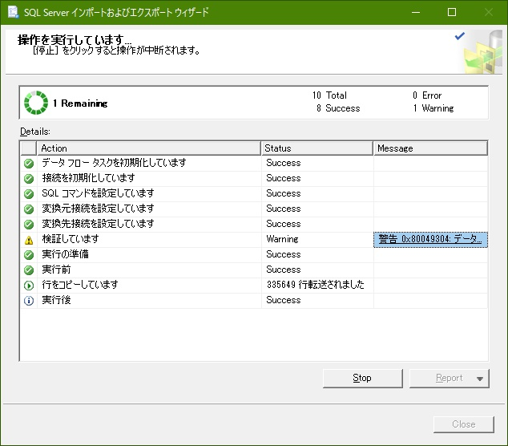
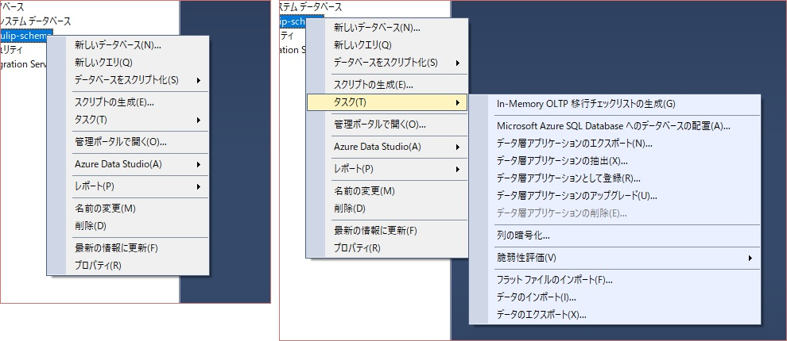

SQL Server Note (SQLserverNote)
===


## 環境作成

- SSMS と SQLserver インストール。


## 環境編

### ローカルの SQL server に繋ぐとき

SSMS で SQL server で自分のPCを選択して windows認証。

### Azure の SQL server に繋ぐとき

- Server type: Database Engine
- Server name: `...database.windows.net` みたいなやつ
- Authentication: SQL Server Authentication

## って何? 編

### 01. 認証が2種類あんの何?

- Windows認証: デフォルトの認証。
- SQL Server認証: 専用ユーザ、パスワードでの認証。

### 02. セキュリティ > ログイン にある sa って何?

最高権限をもつユーザ。Mysqlのrootみたいなもんかな? sysadminロールを持つ。

ただし使用は推奨されないっていうかMicrosoftはSQL Server認証自体を認証してない。デフォルトでは無効になっている。(アイコンにバツがついてる。)


## SQL 編

### 01. LIMIT がやりたい

n 件目から m 件を取得。

```sql
SELECT *
    FROM table
    OFFSET n ROWS FETCH NEXT m ROWS ONLY
```

いちばんはじめから3件。

```sql
    OFFSET 0 ROWS FETCH NEXT 3 ROWS ONLY
```

一度の表示件数が5件で、3ページ目。(11件〜15件)

```sql
    OFFSET 10 ROWS FETCH NEXT 5 ROWS ONLY
```

### OFFSET FETCH を速くする方法

```sql
-- これを
OFFSET 0 ROWS FETCH NEXT 20 ROWS ONLY

-- こうする
DECLARE @a int = 20;
OFFSET 0 ROWS FETCH NEXT @a ROWS ONLY
```

参考: [大きいデータの時の OFFSET FETCH は定数でクエリ書いた方が有利そう？](https://odashinsuke.hatenablog.com/entry/2016/06/28/221732)

**パラメータ化すると内部でソートの方法が変わる**のでそういうことになると言う。……が、意味がよくわからない。わかるときはくるだろうか。

### 02. SQL の中で変数使いたいんですけど

`DECLARE` で宣言するときは型に注意しないとだめ。 `string` とかざっくりしたのは使えない。めんど。

```sql
DECLARE @NUM char(6);
SET @NUM='000010';
DELETE FROM table1 WHERE code=@NUM;
DELETE FROM table2 WHERE code=@NUM;
DELETE FROM table3 WHERE code=@NUM;
```

### 03. 全テーブルの件数を知りたい

```sql
SELECT
    OBJ.name, IND.rows
FROM sys.objects AS OBJ
JOIN sys.sysindexes AS IND
ON OBJ.object_id = IND.id AND IND.indid < 2
WHERE OBJ.type = 'U'
ORDER BY OBJ.name;
```

`type='U'` はユーザテーブル。

### 04. SQLの履歴が見たい

```sql
SELECT creation_time, text
FROM   sys.dm_exec_query_stats qs
CROSS APPLY sys.dm_exec_sql_text(qs.sql_handle) st
WHERE creation_time >= 'yyyy-mm-dd'  -- 別になくてもいいけどね
ORDER BY creation_time DESC -- 別になくてもいいけどね
```

### オートインクリメントにする

```sql
column_name bigint IDENTITY(1,1) NOT NULL
```

## SSMS 絞り込んで編集する

上位200行の編集 > 上メニューのクエリデザイナー > ペイン > SQL

## 重複削除 最新

```sql
SELECT
    id,
    MAX(update_at) update_at
FROM table
WHERE id = 1214
GROUP BY id
```

## Azure で SQLserver

- ポータルから SQL データベースを選択。
- 追加
- サブスクリプション、リソースグループ、データベース名、サーバー選択
    - 疑問: ここの「データベース名」は、データベース本体を指すのかスキーマを指すのか?
        - とりあえず tulip-database にしとく。スキーマなら tulip-scheme にしたい。
        - 判明: スキーマを指している。
    - 疑問: ここの「サーバー」は DB が入る VM のことか?
        - tulip-server
        - tulip:aaa111$$$(記号とか数値とか英数字を含めないといけないからこんなパスワード。)
        - 判明: そのとおり。 VM の URL に使われる。
- エラスティックプールとかいうのはよくわからんから「いいえ」。
- コンピューティングとストレージ、データベースの構成
    - もともと設定されている「Gen5、2 仮想コア、10 GB ストレージ」の月ごとの推定コストが28,800円
    - 設定画面の DTU(Database Transaction Unit)は、  CPU メモリ I/O の組み合わせ。
    - 50 DTU にしたら Standard S2 というものになり、推定コストが9,500円になったのでこれにしてみる。
- 照合順序
    - SSMS のデータベース右クリック > プロパティから見えるやつ。 Japanese_CS_AI にしてみる。
- 作成

既存の SQLserver からエクスポートするやり方。

- SSMS でエクスポート元を右クリック > タスク > データのエクスポート > ウィザードが開く
- .NET Framework Data Provider for SqlServer > エクスポート元の connectionString
- エクスポート先の connectionString も入力。



## SSMS インポートおよびエクスポートウィザードで失敗する件

テーブル間の collation、照合順序が違うとエラーが出る事がわかった。

## SSMS データベースのバックアップが項目ごと存在しない件

いろんなサイトで、データベース右クリック > タスク > バックアップを選択、といわれているが、ない。



## 今日、 n 週間前、今日～ n 週間前

```sql
-- 今日
GETDATE()
-- 1週間前
DATEADD(week, 1, GETDATE())
-- 2週間前から今日
date_field BETWEEN DATEADD(WEEK, -2, GETDATE()) AND GETDATE()
```
