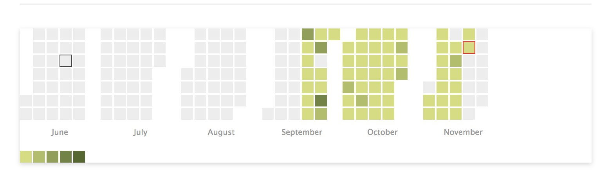

cal-heatmap Note
===

GitLab, GitHub 風の芝生を js で生成したくない? したいだろ?

## 必要ライブラリ

- [https://cal-heatmap.com/](https://cal-heatmap.com/)
    - ここで `cal-heatmap` と `d3.js` を入手して HTML で読み込んでおく。
    - あっ jQuery も一応。


## 元データの形式

- `{タイムスタンプ:数値}` の JSON 文字列を用意。
    - 今回はサーバサイドで JSON 用意してテンプレートへ送った。
    - URL 指定で直接 JSON をよそのサイトから引っ張ってくることもできそうだけど、 `Same Origin Policy` の影響で、よそのドメインの情報を JS からロードすることはできなかった。だからサーバサイドでアクセスしたわけ。
- GitLab では `https://gitlab.com/users/{USERNAME}/calendar.json` の URL でヒートマップの JSON が取れた。
    - ただし形式がタイムスタンプじゃなくて yyyy-mm-dd だったので Python で変換をかけた。

```python
# 変換に使ったコード。こんな感じよ。

json_str = requests.get('https://gitlab.com/users/{USERNAME}/calendar.json')
dic = {}
for key, value in json.loads(json_str).items():
    dic[datestr_to_timestamp(key)] = value
json.dumps(dic)

def datestr_to_timestamp(datestr):
    return int(time.mktime(datetime.datetime.strptime(datestr, '%Y-%m-%d').timetuple()))
```


## JS側

オプションの詳細は上述の公式ページから。

```javascript
function drowCalHeatMap() {
  var cal = new CalHeatMap();
  var obj = $.parseJSON('{{!json}}');  // ここに JSON 文字列。
  var now = new Date();
  var start = now;
  start.setMonth(now.getMonth() - 5);

  cal.init({
    // data:         '{{!json}}',
    data: obj,
    dataType:     'json',
    start:        start,
    itemSelector: '#cal-heatmap',
    domain:       'month',
    subDomain:    'day',
    range:        6,
    cellSize:     15,
    cellPadding:  2,
    cellRadius:   0,
    domainGutter: 1,
    domainMargin: [0, 0, 0, 0],
    domainDynamicDimension: false,
    verticalOrientation: false,
    label: {
      position: 'bottom',
    },
    colLimit:     null,
    rowLimit:     null,
    tooltip:      true,
    highlight:    ['now', now],
    weekStartOnMonday: false,
    minDate:      null,
    maxDate:      null,
    considerMissingDataAsZero: false,
    legend:       [10, 20, 30, 40],
    displayLegend: true,
    legendCellSize: 15,
    legendCellPadding: 2,
    legendMargin: [10, 0, 0, 0],
    legendVerticalPosition: 'bottom',
    legendHorizontalPosition: 'left',
    legendOrientation: 'horizontal',
    legendColors: ['#d2de76', '#51682a'],
    itemName: ['cat', 'cats'],
  });
}
```

## こうなる

これを書いてる段階ではまだブラッシュアップしたいとこあるけど、ひとまずこんな感じ。


