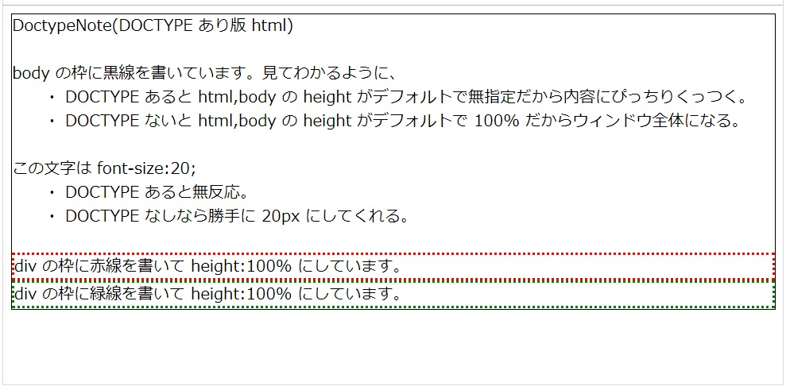
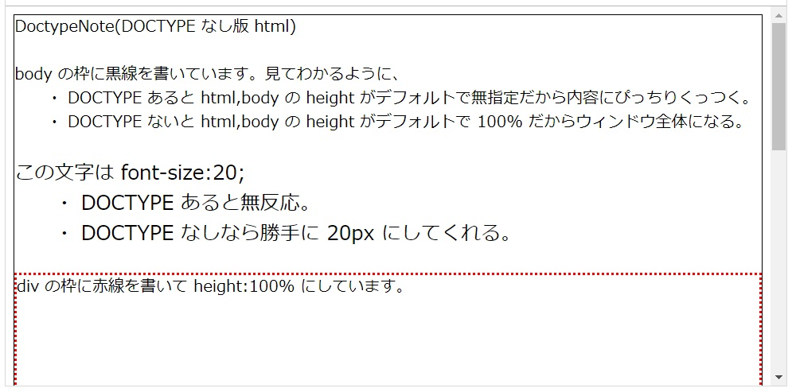

DoctypeNote
===

`<!DOCTYPE HTML>` ありなしの違い。

## 比較

|                        |    あり    |          なし         |
|------------------------|------------|-----------------------|
| html,body の height    | 無指定     | 勝手に 100% になる    |
| font-size:20; と書くと | 無視される | 20px と認識してくれる |

とくに html,body の height の違いがヤバイ。


## 図示





前知識として、 `height:100%` は親要素に `height` が指定されてないと意味がない。

- DOCTYPE あると親要素(body)の height が auto(設定なし)だから赤枠も緑枠も高さは何も変わらん。
- DOCTYPE ないと親要素(body)の height が 100%(ウィンドウサイズと同じ)だから赤枠も緑枠もウィンドウサイズと同じになってる。 **これやばくね?** 直感的じゃなさすぎる。絶対 DOCTYPE ありのほうがいいよね。
    - ていうか html,body に 100% を指定すること自体がヤバイ。
    - ていうかこれでデザインがうまくいかず3時間悩んだからこのノートを書いた。

### 画像のソース

`DOCTYPE` ありの場合。

```html
<!DOCTYPE HTML>
<html>
  <head>
  </head>
  <body style="border:1px solid black; height:100%">
    DoctypeNote(DOCTYPE あり版 html)<br>
    <br>
    body の枠に黒線を書いています。見てわかるように、<br>
    　　・ DOCTYPE あると html,body の height がデフォルトで無指定だから内容にぴっちりくっつく。<br>
    　　・ DOCTYPE ないと html,body の height がデフォルトで 100% だからウィンドウ全体になる。<br>
    <br>
    <span style="font-size:20;">
      この文字は font-size:20;<br>
      　　・ DOCTYPE あると無反応。<br>
      　　・ DOCTYPE なしなら勝手に 20px にしてくれる。<br>
    </span>
    <br>
    <div style="border:2px dotted red; height:100%;">
      div の枠に赤線を書いて height:100% にしています。
    </div>
    <div style="border:2px dotted green; height:100%;">
      div の枠に緑線を書いて height:100% にしています。
    </div>
  </body>
</html>
```
