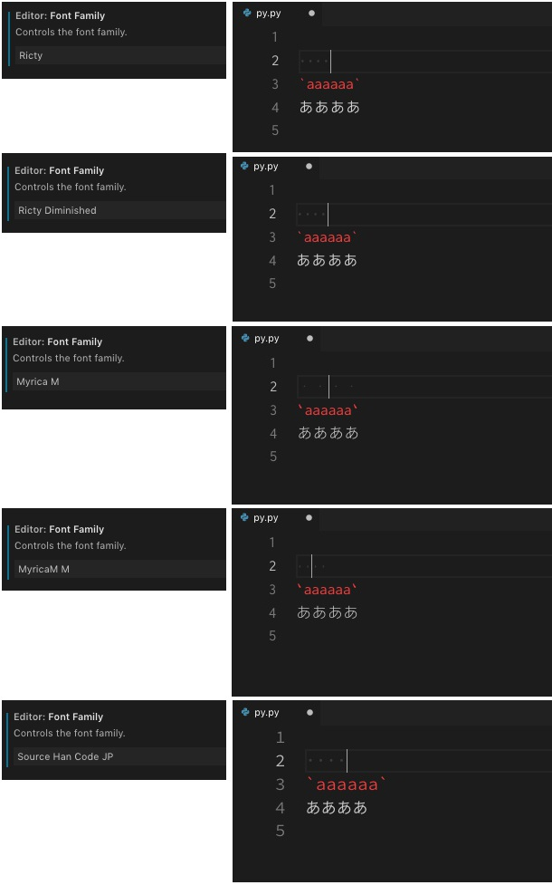

Visual Studio Code Note vscodenote
===


## 概観の推移

#### 2018-04-19

- 使わない。
- いいところもたくさんわかったけど、下記問題がキツイ。
  1. QuickFileOpen(ファイルパスを登録して、ショートカットでファイル開く)が使えない。
  2. grep が現在開いてるフォルダにしか効かない。
- ようは、機能が「現在開いているフォルダ」に絞られるのがイヤ。これが解決すれば使いたい。

#### 2019-03-08

↑という感想だったけど、ペアプロが快適そうなので使ってみる。

#### 2019-04-22

さらに GitHub を介した設定の同期や、Sublime Text Keymap を用いた Sublime ちゃんにキーマップを似せる拡張のおかげでかなり使いやすくなった。気に入った!


## 下知識

- 拡張: 左サイドバーの下の方の四角いアイコンから、拡張機能検索できる。
- Reload: 拡張をインストールすると Reload ってボタンが出る。VSCの再起動で拡張が有効になる。


## ペアプロ

- 拡張 > **VS Live Share**
- 左アイコンが増える > 押す > Start collaboration session > GitHub でログイン


## Settings Sync

- 拡張 > **Settings Sync**
- アップロードは Opt+Shift+U(token 必要)
- ダウンロードは Opt+Shift+D(token, gistID 必要)

### 初回

(2021-01-12)超カンタン、見た通り。昔はこんなん↓で面倒だったなあ。

***

- token 取得
    - Opt+Shift+U
        - GitHub personal access tokens が開く。
        - Token description を書く。
        - gist にチェック。
        - Generate token
- gistID 取得
    - `https://gist.github.com/ユーザ名`
    - cloudSettings のページのURL末尾文字列。

### Sync : 無効もしくは期限切れの GitHub Token です.

- コマンドパレットで `sync` って打って `Advanced Options`
- `Edit Extension Local Settings` を押すと syncLocalSettings.json が開く。
- `token` の値を変えればいい。

### Sync : You cant edit GIST for user

「てか再サインインさせろよ。 gist を選ぶ画面をもう一度見せろ」

- ↑の方法で syncLocalSettings.json を開いて、中身を全部消すと再びサインインボタンが出る。
- gist をもう一度選べるようになる。

## 検索

- ファイル名: ⌘ + p
- グレップ: ⌘ + Shift + F


## 画面端折返し

- Opt + z
- Sublime同様 ⌘ + Shift + p -> word でもできる。


## マルチカーソル

上メニュ > 選択 > マルチカーソル のところにショートカットが書いてある。

(以下はWinで試したからショトカがWinだよ。)

- Alt+クリック
- Ctrl+Alt+上下


## increment selection

- 拡張 > Increment Selection


## コンソールを PowerShell から cmd に変更

ユーザーセッティング > Terminal Integrated Shell: Windows にcmdのパスを記述。

```
C:\\WINDOWS\\system32\\cmd.exe
```

```
"terminal.integrated.shell.windows": "C:\\Program Files\\Git\\bin\\bash.exe",
```

いや PowerShell と cmd を並列で使いたいよね? かゆいところに手が届かないな。


## Code alignment

Code alignment で導入。


## フォント問題

#### Windows では MyricaM M か Source Han Code JP

|        Font        |            Impression            |
|--------------------|----------------------------------|
| Ricty              | 半角スペースの表示がおかしい。   |
| Ricty Diminished   | バッククォートの表示がおかしい。 |
| Myrica M           | 半角スペースの表示がおかしい。   |
| MyricaM M          | OK.                              |
| Source Han Code JP | OK. 全角:半角のサイズ差が2:3     |


#### Mac では Ricty, Ricty Diminished か Source Han Code JP

|        Font        |           Impression           |
|--------------------|--------------------------------|
| Ricty              | OK.                            |
| Ricty Diminished   | OK.                            |
| Myrica M           | 半角スペースの表示がおかしい。 |
| MyricaM M          | 半角スペースの表示がおかしい。 |
| Source Han Code JP | OK. 全角:半角のサイズ差が2:3   |




## tpl を html シンタックスハイライトにする

usersettings > associations で検索 > settings.json を開く > 以下追記。

```json
"files.associations": {
    "*.tpl": "html"
}
```


## とにかくショートカットキーを変えたい

Command palette > `Open Keyboard Shortcuts`

見やすい。これは**ショートカット名でもショートカットキーでも検索できる**最高のキーバインディング設定画面だ。


## 言語ごとにタブサイズ インデントサイズの設定

Command palette > configure language specific settings > 言語を選択

```json
"[python]": {
    "editor.tabSize": 4
},
```


## Pylint による Unable to import

- `which python` で表示されるパスをコピー
- .vscode/settings.json に追加。

```json
{
    "python.pythonPath": "/Path/To/python"
}
```


## Markdown preview

コマンドパレットで `markdown`。


## HTML を編集するとき勝手に終了タグにマルチカーソルがつく

`Mirror Cursor On Matching Tag` のチェックを外す。


## 全体の拡大と縮小

- `Open Keyboard Shortcuts` で `zoom` を見ればわかる。
    - ↑これはガチ。まったく意味不明だけれど、この画面を開いた状態じゃないとショートカットが成功しなかったりする。
- デフォルトだとたぶん Command + - と Command + Shift + - かな。
- なんか謎だけど押す順番が関係あった。 Shift > Command > - の順番で拡大が成功した……。


## Python の linter と formatter を導入

```
Linter flake8 is not installed.
```

拡張機能

- Python
- autoDocstring

```bash
pip install flake8 autopep8
```

Command + , > associations > Edit in settings.json

```json
"python.linting.pylintEnabled": false,  // 標準の pylint をオフ。
"python.linting.flake8Enabled": true,  // PEP8 の linting をオン。
"files.autoSave": "afterDelay",  // ファイル自動保存。
"files.autoSaveDelay": 1000,  // 1秒ごとに自動保存。
"python.linting.lintOnSave": true,  // 保存後に linting。
"python.linting.flake8Args": [
    // PEP8 エラーコード一覧。
    // https://pep8.readthedocs.io/en/latest/intro.html
    "--ignore=",
    // 行の長さ。
    "--max-line-length=80",
    // 循環的複雑度。
    "--max-complexity=20"
],
"python.formatting.provider": "autopep8",
"python.formatting.autopep8Args": [
    "--aggressive",
    "--aggressive",
],
```

## code コマンド

コマンドパレットで Shell Command: Install 'code' command in PATH。

```bash
# 拡張を見る。
code --list-extensions
```

## Sync : You cant edit GIST for user

