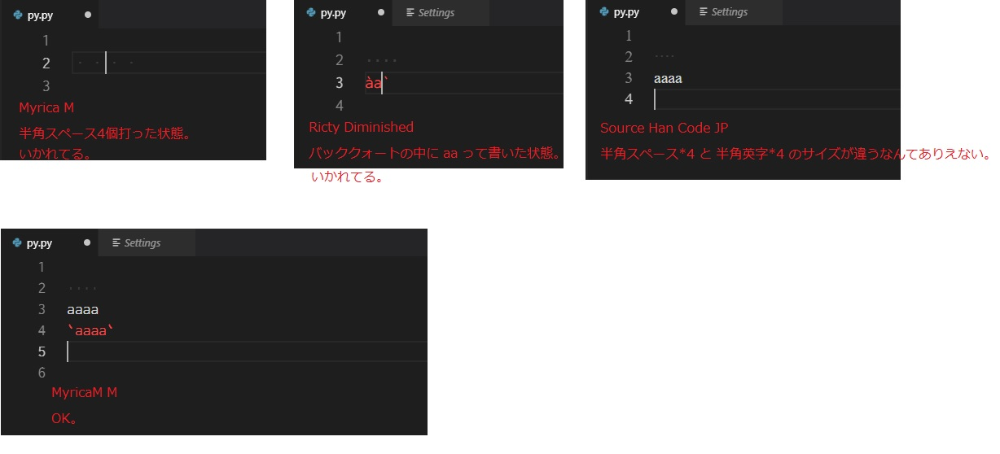

Visual Studio Code Note vscodenote
===


## 感想

#### 2018-04-19

- 使わない。
- いいところもたくさんわかったけど、下記問題がキツイ。
  1. QuickFileOpen(ファイルパスを登録して、ショートカットでファイル開く)が使えない。
  2. grep が現在開いてるフォルダにしか効かない。
- ようは、機能が「現在開いているフォルダ」に絞られるのがイヤ。これが解決すれば使いたい。

#### 2019-03-08

↑という感想だったけど、ペアプロが快適そうなので使ってみる。


## 下知識

- 拡張: 左サイドバーの下の方の四角いアイコンから、拡張機能検索できる。
- Reload: 拡張をインストールすると Reload ってボタンが出る。VSCの再起動で拡張が有効になる。


## ペアプロ

- 拡張 > **VS Live Share**
- 左アイコンが増える > 押す > Start collaboration session > GitHub でログイン


## 設定の同期

- 拡張 > **Settings Sync**
- アップロードは Opt+Shift+U(token 必要)
- ダウンロードは Opt+Shift+D(token, gistID 必要)

#### 初回設定

- token 取得
    - Opt+Shift+U
        - GitHub personal access tokens が開く。
        - Token description を書く。
        - gist にチェック。
        - Generate token
- gistID 取得
    - `https://gist.github.com/ユーザ名`
    - cloudSettings のページのURL末尾文字列。

#### token と gistID の確認

- token: [https://github.com/settings/tokens](https://github.com/settings/tokens)
    - これ忘れたときは Regenerate する感じみたい。
- gistID: 上述


#### ダウンロードでエラー

```
Sync : 無効もしくは期限切れの GitHub Token です.
```

一度これが出ちゃったとき再設定する方法。

- コマンドパレットで `sync` って打って `Advanced Options`
- `Edit Extension Local Settings` を押すと syncLocalSettings.json が開く。
- `token` の値を変えればいい。


## 検索

- ファイル名: ⌘ + p
- グレップ: ⌘ + Shift + F


## 画面端折返し

- Opt + z
- Sublime同様 ⌘ + Shift + p -> word でもできる。


## マルチカーソル

上メニュ > 選択 > マルチカーソル のところにショートカットが書いてある。

(以下はWinで試したからショトカがWinだよ。)

- Alt+クリック
- Ctrl+Alt+上下


## increment selection

- 拡張 > Increment Selection


## コンソールを PowerShell から cmd に変更

ユーザーセッティング > Terminal Integrated Shell: Windows にcmdのパスを記述。

```
C:\\WINDOWS\\system32\\cmd.exe
```

いや PowerShell と cmd を並列で使いたいよね? かゆいところに手が届かないな。


## Code alignment

Code alignment で導入。


## フォント問題

- Windows では MyricaM M
- Mac では Ricty



Windows

|        Font        |                                Impression                                |
|--------------------|--------------------------------------------------------------------------|
| Myrica M           | 半角スペースが全角サイズで表示される。                                   |
| Ricty Diminished   | バッククォートが死んでる。                                               |
| Source Han Code JP | 半角スペースが死んでる。しかも日本語のサイズが英字*3のサイズで見づらい。 |
| MyricaM M          | 上述の問題がない。                                                       |

Mac

|       Font       |                     Impression                    |
|------------------|---------------------------------------------------|
| Myrica M         | Winと同じ問題。                                   |
| MyricaM M        | Winでは問題なかったのに、半角スペースが死んでる。 |
| Ricty Diminished | WinのSource Han Code JPと同じ問題。               |
| Ricty            | 上述の問題がない。                                |


## tpl を html シンタックスハイライトにする

usersettings > associations で検索 > settings.json を開く > 以下追記。

```json
"files.associations": {
    "*.tpl": "html"
}
```
