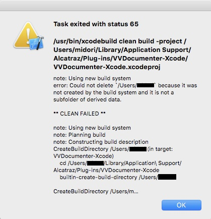
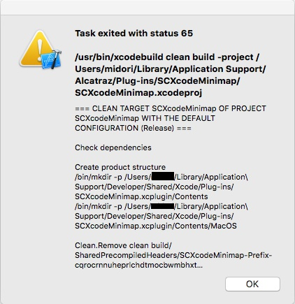

xcodeNote
===

xcodeはクソ。

- swiftの仕様バージョンごとに変わりすぎ。ネットのtipsが役に立たない。
- \*.\* ごとにエラーが出るってどういうことだよ。互換なさすぎ。 
- エラー文がわけわかんない。ひとつのエラー文に対し問題のバリエーションが多すぎ。
- メモリ食い過ぎ。
- 公式ドキュメントが読みづらい。PHPは高望みとしてもPythonくらいにはして。
    [https://developer.apple.com/documentation](https://developer.apple.com/documentation)
- 公式にプラグインを入れられない。プラグインを入れるにはアンサインしないといけない。
- エディタがSublimeに比べて機能貧弱。


## Shortcuts

### 00. 変更方法

Cmd+, > Key Binding > Key Binding Set > Manage Key Binding > + Duplicate Default で自分専用を増やす。

    Show Previous Tab    Cmd+Opt+←
    Show Next Tab        Cmd+Opt+→
    Select Line          Cmd+L
    Delete Line          Cmd+Shift+X  ほんとは無選択時にCmd+Xで行ごと切り取りがほしいんだよ。なんでねーの。
                                      無選択時Cmd+Cで行コピーができないのも不便。

### 01. ビルド

    Cmd+B          ビルド。
    Cmd+R          ビルドしてラン。
    Cmd+.          ランの状態の終了。
    Cmd+Q          シュミレーターの終了。
    Cmd+Shift+K    クリーン。エラー発生->実装は間違っていない->とりあえずクリーン。

### 02. エリアの表示非表示

    Cmd+0~7        ナビゲータエリアの表示/非表示切替は0。
    Cmd+Opt+0~7    ユーティリティエリアの表示/非表示切替は0。
    Cmd+Shift+Y    デバッグエリアの表示/非表示切替。

### 03. デバッグ

    Cmd+Ctr+Y    ブレークポイントで止まった処理をコンティニュー。

### 04. エディタ

    Ctr+6             現在のファイル内のプロパティとメソッドを表示します。
    Cmd+Shift+o       プロジェクト内のファイル、メソッド、変数を検索。
    Cmd+Click         選択したオブジェクトの定義に移動。
    Cmd+Ctr+J         定義に移動。慣れるとClickより速い。
    Cmd+Ctr+←         戻る的な動作のショートカット。→で進める。
    Cmd+T             タブの追加。あらかじめstoryboardは開いておくといい。
    Cmd+Shift+[or]    タブの移動。(ぼくは Cmd+Opt+左右 に変更。)
    Cmd+Opt+/         Docコメント。

### 05. Git

    Cmd+Opt+C     コミット。
    Cmd+Return    コミットのコメント挿入画面で、コミットの実行。

### 06. マルチカーソル

    Opt+Drug
    Shift+Ctrl+Click

## プラグイン(断念)

断念したが記録だけは残す。要約すると「xcode死ね」。IDE依存の開発なんてサイテーだ。

- パッケージ管理ツール Alcatraz インストール(できた)
- Alcatraz 経由でカラースキームのインストールと変更(できた)
- プラグインのインストール(__できない__)

### 01. Alcatraz

Sublime の Package Control にあたる Alcatraz をインストール。

[【Xcode 8対応版】Xcodeプラグイン Alcatrazを導入しよう - Qiita](https://qiita.com/ryoegu/items/e181a7942e4135958a99)

```bash
$ curl -fsSL https://raw.github.com/supermarin/Alcatraz/master/Scripts/install.sh | sh
    # Xcode8以降は対応していないため以下のコマンドも必要になる。
$ sudo gem install -n /usr/local/bin update_xcode_plugins
$ update_xcode_plugins
$ update_xcode_plugins --unsign
    # xcodeを署名しない状態にする。
# xcode 開くと Warning が出るので Load Bundle を押す。ここでいったん落ちるかも。
# そしたらまた開き直して Window > Package Manager があるのを確認。
```

xcodeを無署名にするとUITestsが使えないとかあるらしい。もとに戻したかったら __まずプラグインを削除__ してから……

```bash
$ rm -rf ~/Library/Application\ Support/Developer/Shared/Xcode/Plug- ins/Alcatraz.xcplugin
$ rm -rf ~/Library/Application\ Support/Alcatraz
    # Alcatrazを削除。
$ update_xcode_plugins --restore
    # xcodeの状態を復元する。
```

### 02. カラースキーム

Alcatraz からサクッとインストールできるが……もうプラグインは諦めるので、それなしでインストールする方法を。

[Space Gray & Silver Xcode Themes](https://github.com/zdne/spacegray-xcode)

    Download & unzip the latest release.
    In Finder, Go > Go to Folder and paste ~/Library/Developer/Xcode/UserData/FontAndColorThemes, press enter.
    Copy Space Gray.dvtcolortheme and Silver.dvtcolortheme from the downloaded archive into the FontAndColorThemes directory.
    Relaunch Xcode, Xcode > Preferences... in Fonts & Colors select Space Gray or Silver.

### 03. プラグインのインストール(できない)

インストールしようとするとこんなダイアログが出る。これが解決できなかった。



- status 65 で調べる。 -> 今回の問題と一致しない。
- xcode10 の New Build System が問題かと思ってこういう記事を試す。 -> 変わらない。
    - [Xcode 10 & New Build System (Default) でビルドするまで](https://qiita.com/basi/items/36bd615f78cc966d73f2)
- プラグインのgithubページにある別の方法「.xcodeprojをダウンロードしてビルド」試す。 -> linker エラー。
    - `Undefined symbols for architecture x86_64: "_OBJC_CLASS_$_IDESourceCodeComparisonEditor"`
    - `linker command failed with exit code 1 (use -v to see invocation)`
- プラグインのgithubページにある別の方法「.xcpluginをダウンロードしてPlug-inフォルダに配置」試す。 -> 何も起こらない。
- xcode9.4.1 をインストールして試す。 -> 上の VVDocumenter-Xcode は入ったが Minimap が入らない。
    - そしてDocumenterのほうも何も起こらない。



一日かけてここまで試した。まあ少し状況が変わったんだからこのまま進めてもいいところだが、この頃から謎のxcodeフリーズFinderフリーズプレビューフリーズが頻発して嫌になった。もういい。xcodeクソ。ひとつのエラー文に関して複数の問題候補があるのが非常にクソ。Pythonとか見習え。

つーかswiftもそうだけどxcodeも変化がありすぎてプラグイン開発がついていかないってことなのかも。xcodeクソ。


## 場合別 tips


