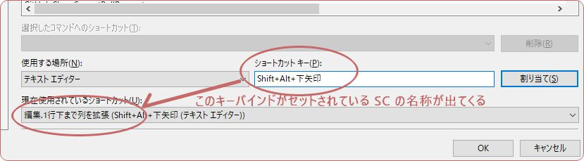

Visual Studio 2017 Note VSNote
===

さてVSはどんなもんかな?

## Shortcuts

### 00. 変更方法

ツール > オプション(ウィンドウ開く) > 環境 > キーボード >
コマンドを選ぶ > 使用する場所・ショートカットキーを入力 > 割り当てクリック

    編集.名前の変更    Ctrl+R,Ctrl+R    参考サイトでやってたからなんとなく登録

### 01. ビルド

    Ctrl+B

### 02. エリアの表示非表示

    全部「自動的に隠す」にしといてほしいときに出す。
    Ctrl+Alt+L    ソリューションエクスプローラ

### 03. デバッグ

    F5         ふつーに実行
    Ctrl+F5    コンソールプログラムのときこれで実行すればプロンプトが消えないよ

### 04. エディタ

    Ctrl+,                      ソリューション内ファイル移動
    Ctrl+Alt+pageup,pagedown    タブ移動
    Ctrl+F4                     タブ閉じる

    Ctrl+M,Ctrl+M               アウトライン切り替え  これは使いこなせば便利かな?
    Ctrl+M,Ctrl+L               すべてのアウトライン切り替え

    Ctrl+X                      無選択で行まるごと切り取り  Sublimeと同じだね

    Ctrl+K,Ctrl+C               コメント ただし拡張機能で Ctrl+/ にするけどねぼくは
    Ctrl+K,Ctrl+U               コメント解除 同上

    F12                         定義へ移動
    Ctrl+F12                    実装へ移動
    Ctrl+-                      ↑から戻る
    Shift+F12                   参照をリストアップ
    Ctrl+Shift+12               エラー箇所へ飛ぶ

    Ctrl+,                      SublimeのCtrl+Pにあたるやつ 最近多用する

### 05. TODO管理

- ショートカットは `Ctrl+\,t`
- 表示 > タスク一覧 でもOK
- タスクのトークンを追加とかしたいとき ツール > オプション > 環境 > タスク一覧
    - ここにもともと3つ登録されてるんだけど……こういう意味なんだって。
    - HACK  : 要改変
    - TODO  : 未実装
    - UNDONE: 作業中

### 06. マルチカーソル(こっちではマルチキャレットと呼ばれてる)

    Ctrl+Alt+Click    キャレット追加(SublimeのCtrl+Clickかな)
    Shift+Alt+.       SublimeのCtrl+Dにあたる  ええやん  これがあるのはええよ
    Shift+Alt+,       ↑のCtrl+DのあとのCtrl+Uにあたる

## 拡張機能

ツール > 拡張機能と更新プログラム > オンライン

DLしてからVSを全部とじると VSIXインストーラー が出てくる。そこから 変更 を押すとインストールされる。

### Toggle Comment

Ctrl + / でコメントアウトができる。そりゃコメントアウトのショトカはこれですよねえ。

むしろこれ目当てで拡張機能に手を出した。

### Custom Document Well

ツール > オプション > Productivity Power Tools > Tab Well Appearance and Behaviour

から設定。タブタイトルの表示を横から縦にできる。物珍しさで入れてみたが、タブの順番を入れ替えるのがデフォルトよりラク。

### Git Diff Margin

Git上での変更点をエディタに表示。必須ってわけじゃないけどSublimeで入れてるし、同じ感じにするかと。

### Open on GitHub

プロジェクトが GitHub と連携しているときの話だけど、コード上から GitHub のページを開ける。「ちょいここ見てー」ってときに欲しくなった。

### Code alignment

`=` とかで揃えるやつ。

## 場合別 tips

### タブで開いてるファイルとソリューションエクスプローラのカーソルを合わせる

これは絶対要る。

ツール > オプション > プロジェクトおよびソリューション > アクティブな項目をソリューションエクスプローラで選択された状態にする

### IDE からファイルをエクスプローラで開きたくない?

開きたいだろ? そんなんデフォルトでついてろや。

ツール > 外部ツール > 下記を追加

| タイトル     | ウィンドウズ エクスプローラ(&E) |
| コマンド     | explorer.exe           |
| 引数       | /e,"$(ItemDir)"        |
|初期ディレクトリ| 何も書かない              |

### 検索と置換 ウィンドウのクソさを解消

- ツール > オプション > 環境 > 検索と置換 > 「自動的に」「制限」を外す

### キーバインディングの検索を

こうすればキーバインドからショートカット名称を調べられる。いや、つーかもとからキーバインドから検索できるようにしとけよ。

### ミニマップ

スクロールバーを右クリック > スクロールバーオプション > 垂直スクロールバー
