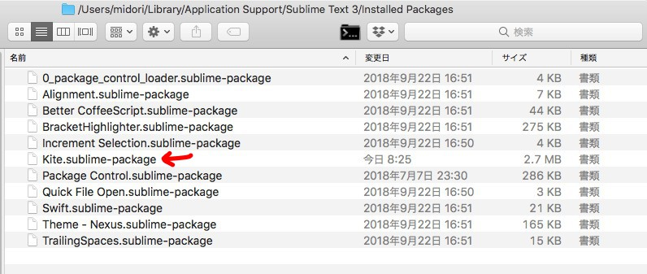
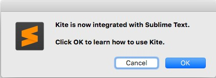
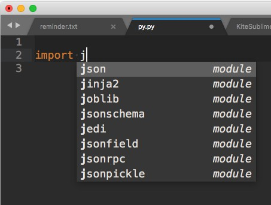
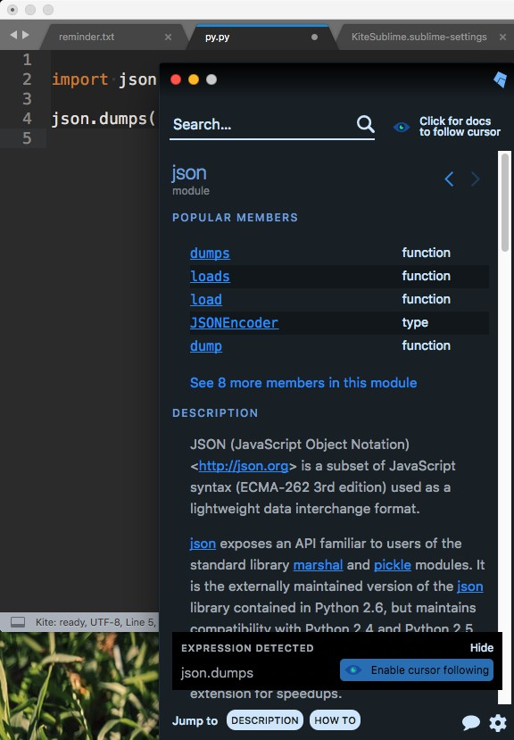

KiteNote
===

## First problem

Kite doesn't work after I installed Kite.app and the plugin for SublimeText3.

## Correct installation

### 01. Kite.sublime-package

- Download `Kite.sublime-package` manually from [here](https://s3-us-west-1.amazonaws.com/kite-plugin-binaries/latest/Kite.sublime-package).
- Place it in `Sublime Text3/Installed Packages`.

### 02. Reopen Sublime

Push OK.

You'll see Kite starts to be ready.

### 03. Check if your Kite works well

You can check along text here, [https://help.kite.com/article/76-using-the-sublime-text-plugin](https://help.kite.com/article/76-using-the-sublime-text-plugin).

### 04. Well...

Kite doesn't work only for that you installed Sublime plugin through Kite copilot. It must be a bug.
