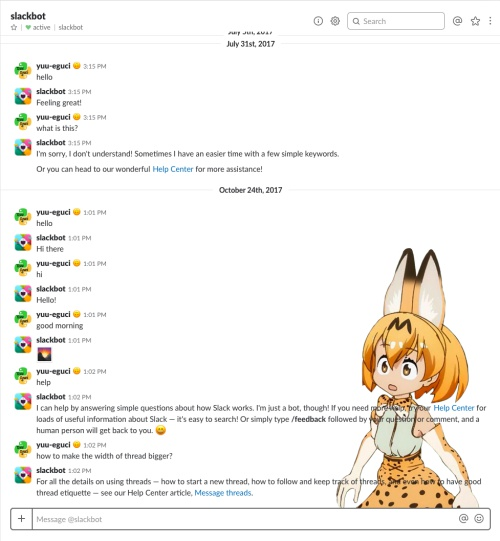

# Slack を CSS で改造ノート

## 追記するファイル

```
Mac
    /Applications/Slack.app/Contents/Resources/app.asar.unpacked/src/static/ssb-interop.js
```

## 背景をダークにする

```javascript
// 背景をダークに。
document.addEventListener('DOMContentLoaded', function() {
 $.ajax({
   url: 'https://cdn.rawgit.com/laCour/slack-night-mode/master/css/raw/black.css',
   success: function(css) {
     $("<style></style>").appendTo('head').html(css);
   }
 });
});
```

## 背景に画像



まず画像をbase64化する。

https://www.base64-image.de/

```javascript
// 背景に画像を表示する。
document.addEventListener('DOMContentLoaded', function() {
  var css = `\
    #messages_container {\
      background-image: url(★ここにbase64データ★);\
      background-repeat: no-repeat;\
      background-position: bottom right;\
    }\
    .c-message--hover {\
      background-color: rgba(240, 240, 240, 0.3) !important;\
    }\
    .c-message--focus {\
      background-color: rgba(240, 240, 240, 0.3) !important;\
    }`
  $("<style></style>").appendTo('head').html(css);
});
```

## 前から不満だった、スレッドの幅を広くする

```javascript
// Thread の幅を広くする。(数値は適当にいじって。)
document.addEventListener('DOMContentLoaded', function() {
  var css = `\
    #client-ui.flex_pane_showing #col_flex {\
      flex-basis: 70%;\
    }`
  $("<style></style>").appendTo('head').html(css);
});
```
