Excel にチェックボックス ExcelCheckBox
===

注意: 全部 Excel For Mac 16.24 でやってる。  
注意: そもそもチェックボックスはおすすめしない。

&nbsp;

## チェックボックス設置

- 開発タブでチェックボックスを選択。

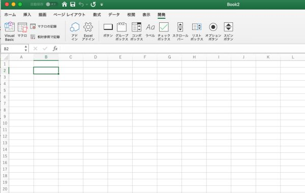

- 設置。

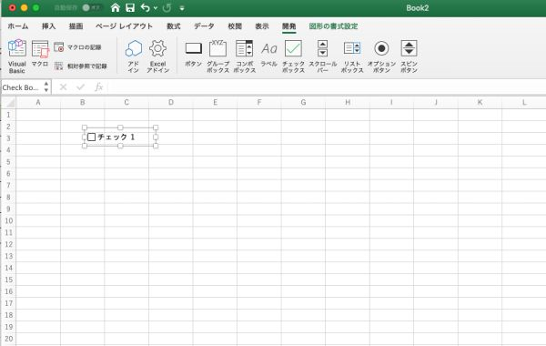

- なんかクリックとかすると文字を消せる。

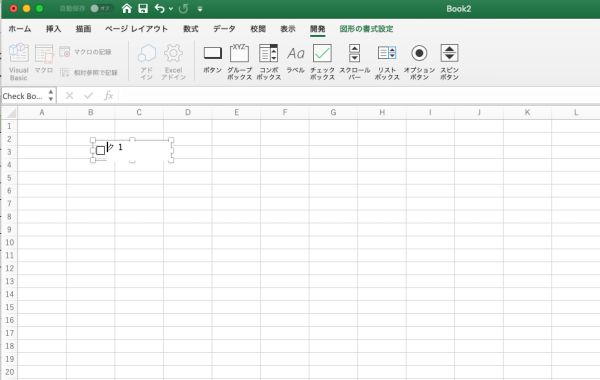

&nbsp;

## チェックボックス整列

- 右クリックして、図形の書式設定タブ。
- グリッドに合わせる。

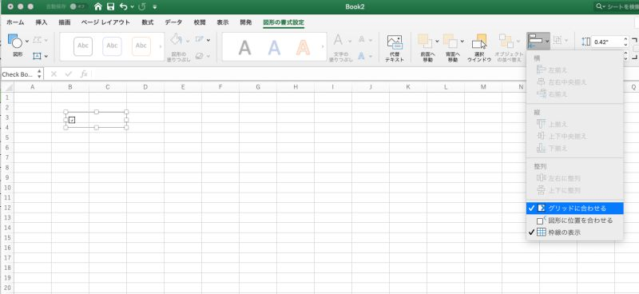

- サイズ調整でセルに合わせることができる。

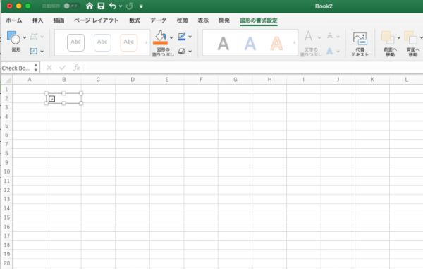

&nbsp;

## チェックしたらセルに色つける

#### チェックボックスとセルを紐づけ

- 右クリックして、コントロールの書式設定。

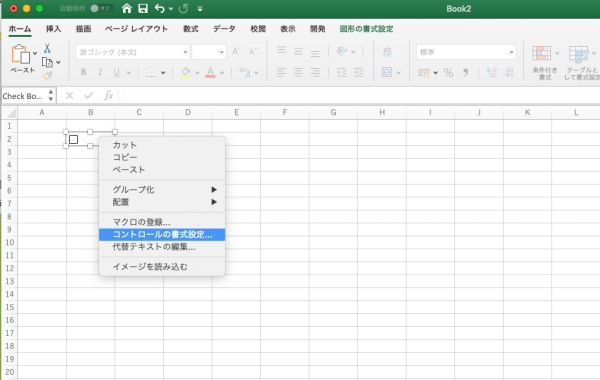

- おまい(チェックボックス)はこのセル(`$B$2`)とペアやからな。

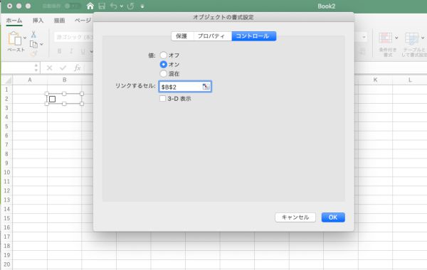

- `B2` セルにチェックボックスの値が表示される。

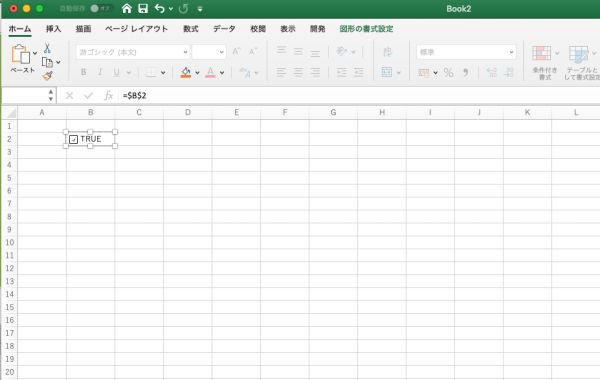

#### 色つけ設定

- セルを選択。チェックボックス(右クリック)じゃないぞ、セルのほうだ。
- ホームタブで条件付き書式を選択。

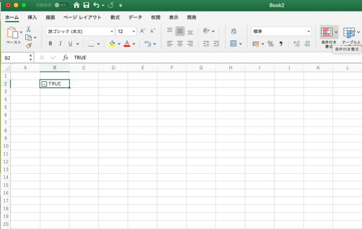

- 新しいルールを選択。

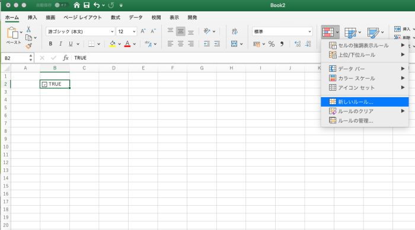

- スタイル: クラシック
- 数式を使用して、書式設定するセルを決定
- `=$B$2=TRUE` (チェックボックスが `B2` と紐付いている場合)

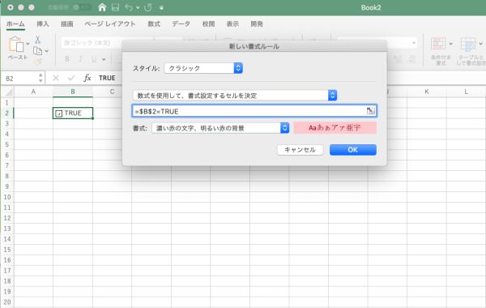

- 完了。

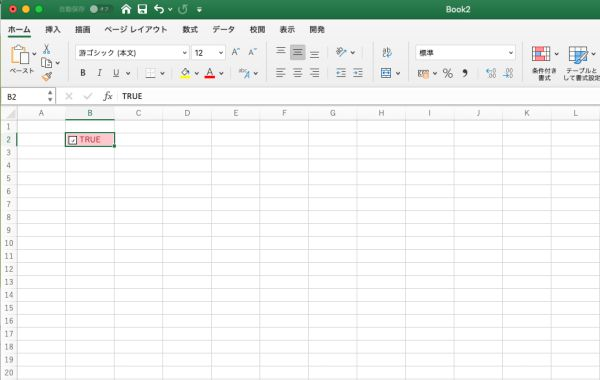

&nbsp;

## TRUE いらねえ

- セルを選択。
- ホームタブで書式を選択。

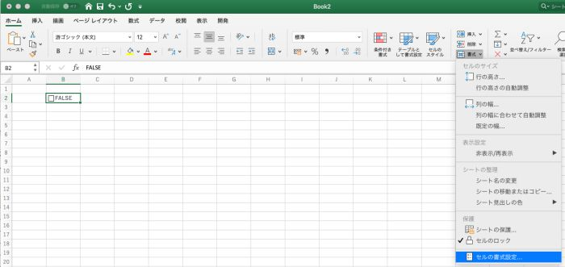

- 表示形式をユーザ定義にして、 `;;;` って書く。なんでかはわからん。

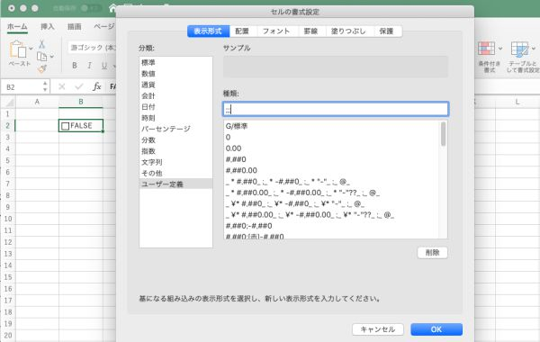

- TRUE とか FALSE って表示されるのが消えた。

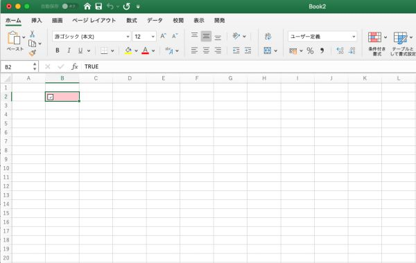

&nbsp;

## 簡単に量産することは出来なさそう

- ためしにもうひとつ作って(下のセルに連動するチェックボックスを作って)ドラッグで増やしてみたけれど……

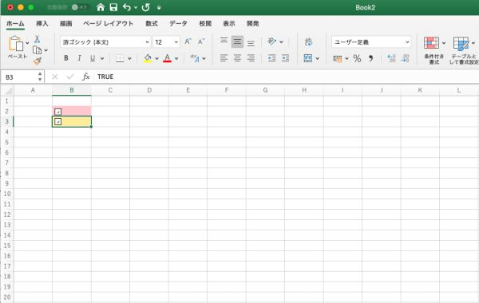

- 各セルに連動するように増えることはなかった。便利に量産したかったらマクロ? とかプログラム書くしかないかも。

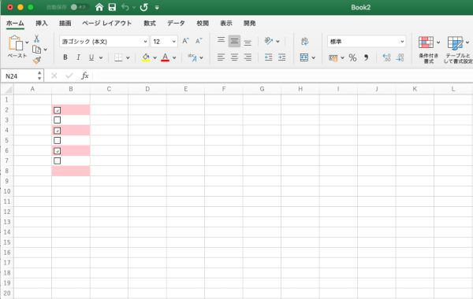
