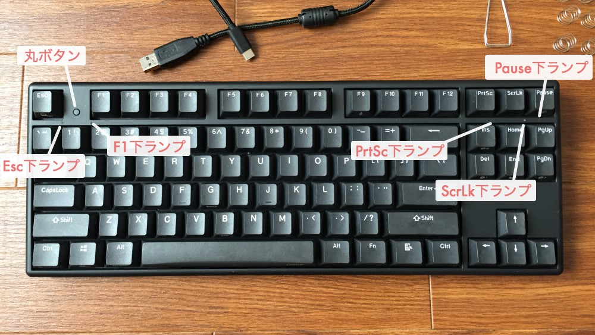

NizNote
===

## X87 EC-Ble

- Esc 下ランプ: Bluetooth。色や点滅で現在の BT 機器やペアリングの状態を示す。
- F1下ランプ: 電源、バッテリーのランプ。点灯の状態で現在の状態を示す。
- PrtSc 下ランプ: いくつかの操作をしたときの反応のためのランプ。および CapsLock のランプ。
- ScrLk 下ランプ: 同上。および Scroll Lock のランプ。
- Pause 下ランプ: Office/Program モードのランプ。光っているとき Program モード。

### 電源

|           やりたいこと           |                   操作                   |                                 ランプ                                  |
|----------------------------------|------------------------------------------|-------------------------------------------------------------------------|
| 放置中の自動電源オフ時間切り替え | ケーブルつないでないときのみ Fn+T 5秒 | 1回光る:放置1時間後切れる 2回光る:2時間後切れる デフォルトは3時間 |
| 電源を入れる                     | 丸ボタン 1秒                             | F1下ランプが少し光る                                                    |

### バッテリー

|           やりたいこと           |                   操作                   |                   ランプ                    |
|----------------------------------|------------------------------------------|---------------------------------------------|
| バッテリー残量確認               | ケーブルつないでないときのみ Fn+Y 3秒 | 右上の3つ全部光る:フルパワー 点滅:少ない |
| ゲームモード(ハイパフォーマンス) | Fn+Game                                  | ランプが1回光る                             |
| Eco モード(省電力)               | Fn+Eco                                   | 他のランプも光って消える                    |

ケーブル接続時の F1下ランプの光り方

- 光っている: バッテリー充電中
- 消えている: 充電完了
- 点滅: 低電力

### キーの修正

|          やりたいこと         |        操作        |                                      ランプ                                      |
|-------------------------------|--------------------|----------------------------------------------------------------------------------|
| タイプ反応深度の調整          | Fn+反応深度キー    | 1回光る:一番浅い位置 2回光る:中くらいの位置(初期位置) 3回光る:一番深い位置 |
| Windows キー無効化            | Fn+WindowsLock 3秒 | 1回光る:Win キーアンロック 2回光る:Win キーロック                             |
| Ctrl Caps 入れ替え            | Fn+CapsChange 3秒  | 1回光る:もとに戻る 2回光る:入れ替わる                                         |
| Mac キー配列にする            | Fn+Win/Mac 3秒     | 1回光る:Windows 配列 2回光る:Mac 配列 備考:Fn の位置が変わるから注意       |
| Office/Program モード切り替え | Fn+Pause           | Pause 下ランプが光っている:Program モード 光っていない:Office モード          |

モード説明。キーボードをオフにしても保存される。

- Office: キーが固定。上書きは不可。
- Program: ユーザ定義可能なモード。 X87EC ソフトウェアを使って定義する。

### Bluetooth

|    やりたいこと    |          操作          |                     ランプ                     |
|--------------------|------------------------|------------------------------------------------|
| ペアリング         | Fn+BT1/2/3 3秒         | Esc 下ランプが速く光っていればペアリング待機中 |
| コネクション       | Fn+BT1/2/3             | 成功すれば5秒点灯してから消える                |
| USB と BT 切り替え | Fn+BT バッテリーマーク |                                                |

Esc 右下ランプの色

- 赤: BT1
- 緑: BT2
- 青: BT3

それぞれのランプの光り方と意味

- 速く点滅: ペアリング待機中
- ゆっくり点滅: リコネクション
- 5秒光って消える: 接続成功

### Bluetooth へ最初に接続する手順

1. ケーブルを外す。
1. 電源ボタンを1秒押す。 F1下ランプ(電源ランプ)が光る。
    - 同時に Esc 下ランプ(BT ランプ)が光る。
1. Fn+BT1/2/3 3秒押下でつなぎたい番号を選ぶ。
    - 赤/緑/青
1. 機器のほうでキーボードを選択。

### PS/2

|     やりたいこと     |       操作       |                         ランプ                         |
|----------------------|------------------|--------------------------------------------------------|
| USB と PS/2 切り替え | Fn+BackSpace 5秒 | 1回光る:USB 接続 2回光る:PS/2 自動認識+USB 手動認識 |

### 初期化

|    やりたいこと    |             操作            | ランプ |
|--------------------|-----------------------------|--------|
| 工場出荷状態に戻す | Esc+Ctrl(L)+Ctrl(R)+F12 5秒 |        |

### ランプ

|    やりたいこと    |       操作       |        ランプ         |
|--------------------|------------------|-----------------------|
| ランプの明るさ調節 | Fn+Up or Fn+Down | 明るさが4段階で変わる |
