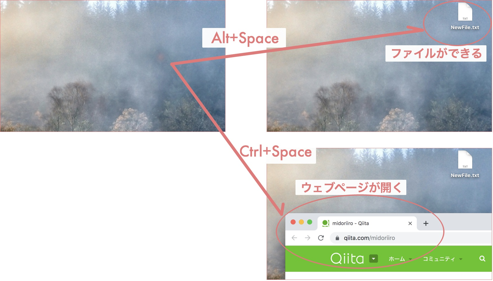

グローバルホットキーアプリの小さなサンプル
===


## 概要

- Mac でも Windows でも
- Python 3.6
- wxPython 4.0.6

グローバルホットキーというものを知りました。どんなアプリがアクティブのときでも、ホットキー押下でプログラムを実行できるのです。 wxPython が持っているこの機能を使って、小さなサンプルを作ってみました。サンプルとして作ってみた機能は以下ふたつ。

- Alt+Space でデスクトップに空ファイル作成。
- Ctrl+Space で Qiita を開く。


## 小さなサンプル



```python
import wx
import os
import webbrowser


class Frame(wx.Frame):

    def __init__(self):
        super(Frame, self).__init__(None)

        # ここで Alt+Space のホットキーを登録しています。
        new_id = wx.NewIdRef(count=1)
        self.RegisterHotKey(new_id, wx.MOD_ALT, wx.WXK_SPACE)
        self.Bind(wx.EVT_HOTKEY, self.Foo, id=new_id)

        # ここで Ctrl+Space のホットキーを登録しています。
        new_id = wx.NewIdRef(count=1)
        self.RegisterHotKey(new_id, wx.MOD_CONTROL, wx.WXK_SPACE)
        self.Bind(wx.EVT_HOTKEY, self.Bar, id=new_id)


    def Foo(self, event):
        """新しいファイルをデスクトップに作ります。"""
        filepath = os.path.join(
            os.path.expanduser('~'),
            'Desktop',
            'NewFile.txt',
        )
        with open(filepath, 'w') as f:
            f.write('')


    def Bar(self, event):
        """Qiita を開きます。"""
        webbrowser.open('https://qiita.com/midoriiro')


app = wx.App(False)
Frame()
app.MainLoop()
```


## ちょっとした所感

### ウィンドウを表示しないくせに Frame を使っている件

`wx.Frame` はウィンドウを担当するクラスです。けれど今回は `frame.Show()` していないため、ウィンドウはどこにも表示されません。ならば `wx.Frame` を使う必要はないのでは? と思うのですが、そうもいきません。ホットキーを登録する `RegisterHotKey` は `wx.Frame` が持っているからです。正確には `wx.Frame` の上位クラスである `wx.Window`  が持っています。

ドキュメント: [https://docs.wxpython.org/wx.Window.html#wx.Window.RegisterHotKey](https://docs.wxpython.org/wx.Window.html#wx.Window.RegisterHotKey)

### 採用しているホットキーが微妙な件

なんで Alt+Space と Ctrl+Space やねんという話です。それは Windows で機能するホットキーがあんまりないからです。 Alt+Up Alt+Down とかにしたかったのだけれど、 Windows では反応しません。 Mac では反応するのに。

### ドキュメント読みづらい件

`RegisterHotKey` の項目に `virtualKeyCode` 一覧へのリンクはあっていいはず! むしろ未発見。どこにあるんですか? [wx.KeyCode](https://wxpython.org/Phoenix/docs/html/wx.KeyCode.enumeration.html) がそうかなと思ったけれど、 `RegisterHotKey` に使えないコードも含まれているし、そもそも存在しない定数も記載してある。(wxPython 4.0.6 にて)

このドキュメントの具合や、ネット上の記事の少なさから、開発終了したライブラリかと思ったのですがバリバリ現役ですね。

GitHub: [https://github.com/wxWidgets/Phoenix](https://github.com/wxWidgets/Phoenix)
