【LINE Messaging API】みんなの LINE へプログラムからメッセージを送りたい
===

## やりたいこと

- 友達登録したユーザに個別のメッセージを送りたい。
- API とか利用して、プログラムからそれを行いたい。


## なぜ LINE Messaging API

似たような、しかしやりたいことができないサービスがあってややこしかった。サービスを選ぶとき迷っちゃったので記載しておく。

- **LINE Notify**
    - 自分か自分の含まれるグループへメッセージを送れる。
    - プログラムから送れる。
    - しかし他人には送れなさそう。
- **LINE公式アカウント**
    - 公式アカウントを作り、友達登録をしたユーザに一斉送付が出来る。個人メッセもできる。
    - しかしそれらはすべてブラウザから手打ちで、自動で個人にメッセする API はなさそう。
- **LINE Messaging API**
    - やりたいことができる。

## 料金

[LINE公式アカウントとは丨料金紹介](https://www.linebiz.com/lp/line-official-account/plan/)に載っている。たぶん、 BOT 機能(自動返信)については無料でいくらでも使えて、 push 機能(能動的送信)については1,000通まで無料で使える。


## LINE Developers でチャネルを作成

この作業をしているとき「Line Developers」と「Line for business」がややこしい。どちらにも「チャネル」に相当するものがあるから。今回使うのは Developers のほう。

- Line Developers: [https://developers.line.biz/](https://developers.line.biz/)
- Line for business: [https://manager.line.biz/](https://manager.line.biz/)

そして「チャネル」「プロバイダ」あたりの用語もややこしい。チャネルはプロバイダの子要素にあたる。ひとつのプロバイダに対し複数のチャネルを作成できる。チャネルが LINE の対話相手になる。

### 新規チャネル作成まで


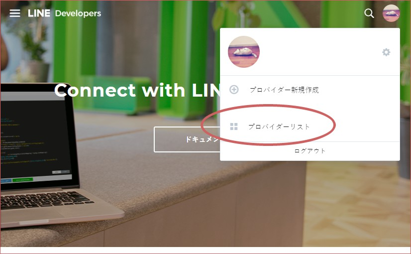

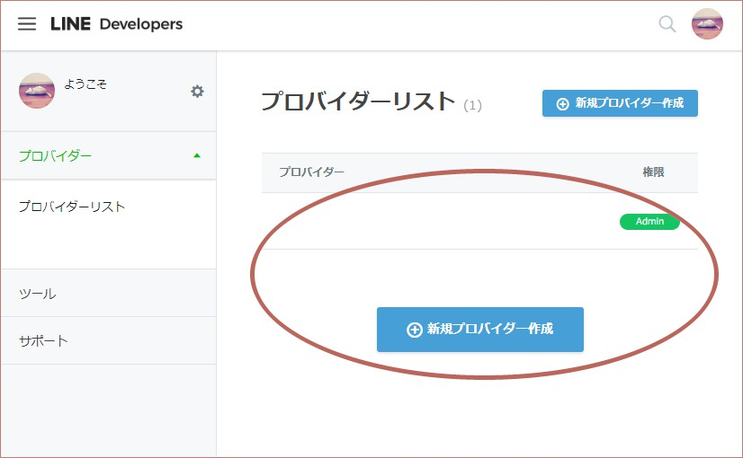

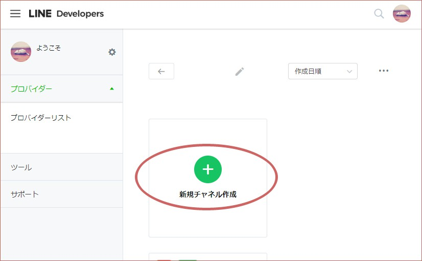

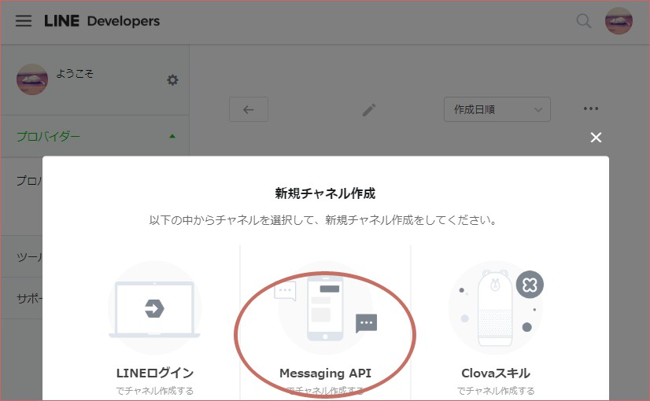

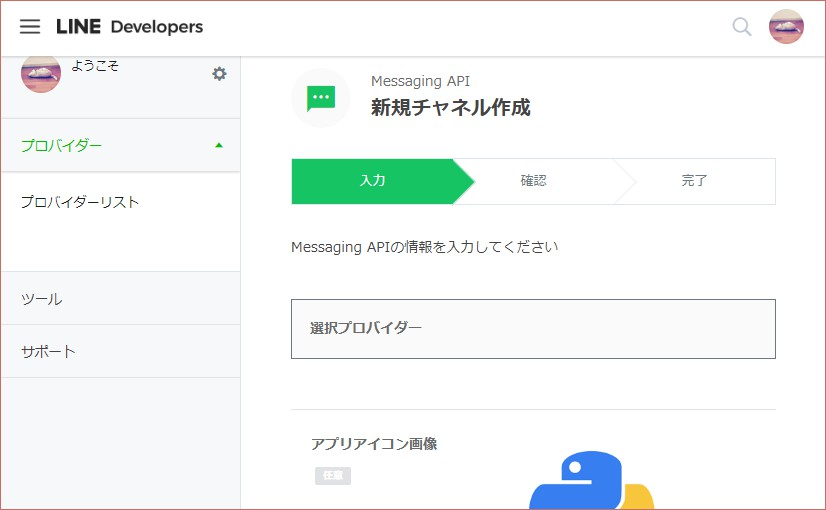

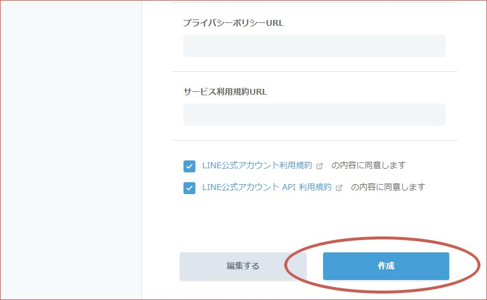

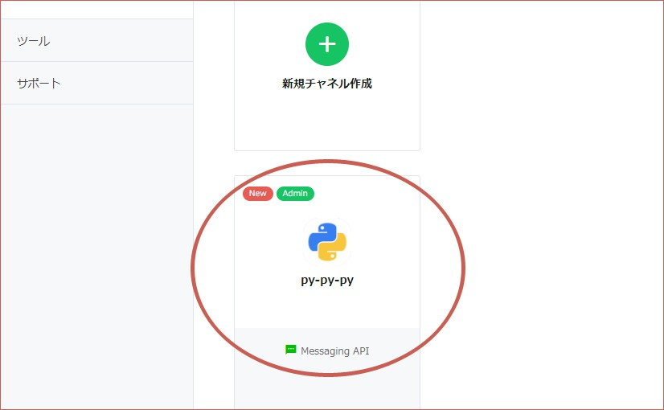

### トークン類の取得

チャネル基本設定から、「Channel Secret」と「アクセストークン」を取得する。

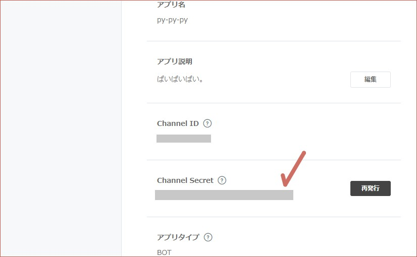

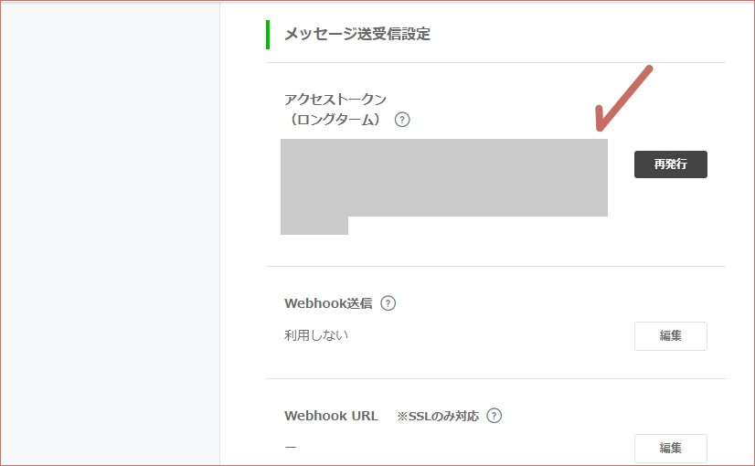


## Python スクリプト作成

ぼくの場合、 pipenv を使うのでこんなふうに環境を準備。

```bash
pipenv install flask line-bot-sdk gunicorn
pipenv shell
```

Python スクリプトは my_flask_script.py って名前にしてみた。ベースのコードは [line-bot-sdk のドキュメント](https://github.com/line/line-bot-sdk-python#synopsis)から取得し、そこへ手を加えた。

```python
from flask import Flask, request, abort

from linebot import (
    LineBotApi, WebhookHandler
)
from linebot.exceptions import (
    InvalidSignatureError
)
from linebot.models import (
    MessageEvent, TextMessage, TextSendMessage,
)

# 環境変数取得のため。
import os

# ログを出力するため。
import logging
import sys

app = Flask(__name__)

# ログを標準出力へ。heroku logs --tail で確認するためです。
# app.logger.info で出力するため、レベルは INFO にする。
app.logger.addHandler(logging.StreamHandler(sys.stdout))
app.logger.setLevel(logging.INFO)

# 大事な情報は環境変数から取得。
CHANNEL_ACCESS_TOKEN = os.environ['CHANNEL_ACCESS_TOKEN']
CHANNEL_SECRET = os.environ['CHANNEL_SECRET']

line_bot_api = LineBotApi(CHANNEL_ACCESS_TOKEN)
handler = WebhookHandler(CHANNEL_SECRET)


# 必須ではないけれど、サーバに上がったとき確認するためにトップページを追加しておきます。
@app.route('/')
def top_page():
    return 'Here is root page.'


# ユーザがメッセージを送信したとき、この URL へアクセスが行われます。
@app.route('/callback', methods=['POST'])
def callback_post():
    # get X-Line-Signature header value
    signature = request.headers['X-Line-Signature']

    # get request body as text
    body = request.get_data(as_text=True)
    app.logger.info('Request body: ' + body)

    # handle webhook body
    try:
        handler.handle(body, signature)
    except InvalidSignatureError:
        abort(400)

    return 'OK'


@handler.add(MessageEvent, message=TextMessage)
def reply_message(event):
    # reply のテスト。
    line_bot_api.reply_message(
        event.reply_token,
        TextSendMessage(text='こちらこーるばっく処理からお送りします:'+event.message.text))


if __name__ == '__main__':
    app.run()
```


## Heroku 用ファイル作成

```bash
# runtime.txt: Python のバージョンを記載。
echo python-3.7.4 > runtime.txt

# requirements.txt: 依存ライブラリの記載。
pip freeze > requirements.txt

# Procfile: プログラムの実行方法を記載。
echo web: gunicorn my_flask_script:app --log-file - > Procfile
```

Procfile は `web: python my_flask_script.py` ではなぜだか動かなかった。


## Heroku へアップ

```bash
# Git リポジトリ作成。
git init
# 個人的な趣味で、最初に空っぽのコミットを作成。
git commit --allow-empty -m "Initial Commit"
# 全ファイルをコミット。
git add --all
git commit -m "Add all files"

# 今回のアプリ名は line-messaging-py-py-py にしてみる。
heroku create line-messaging-py-py-py

# 環境変数を設定。
heroku config:set CHANNEL_ACCESS_TOKEN="チャネル基本設定のページからアクセストークンをコピーしてくる" --app line-messaging-py-py-py
heroku config:set CHANNEL_SECRET="チャネル基本設定のページから Channel Secret をコピーしてくる" --app line-messaging-py-py-py

# Heroku のリポジトリへアップ。
git push heroku master

# 途中でなにか失敗したら destroy で一度消し、 create からやりなおす。
# heroku apps:destroy --app line-messaging-py-py-py
```

トップページのメソッドも作ってあるので開いてみる。

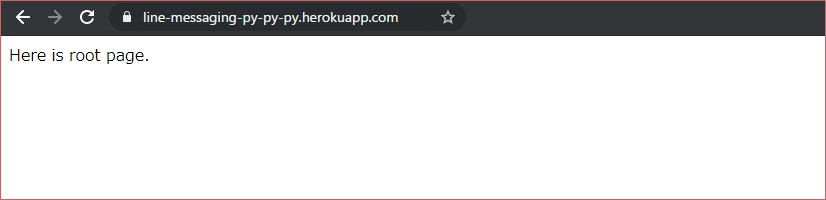

アップが成功していることがわかる。


## Heroku URL をチャネルへ登録

チャネル基本設定のページで Webhook URL を登録し、 Webhook送信 を有効にする。上の Python スクリプトで、 callback を受け付ける URL は `/callback` にしたので、今回の Webhook URL は `https://line-messaging-py-py-py.herokuapp.com/callback` になる。

これはよくわからないのだけれど、「接続確認」をすると赤文字が出て我々を不安にさせる。だがこのまま進んでも問題なさそう。

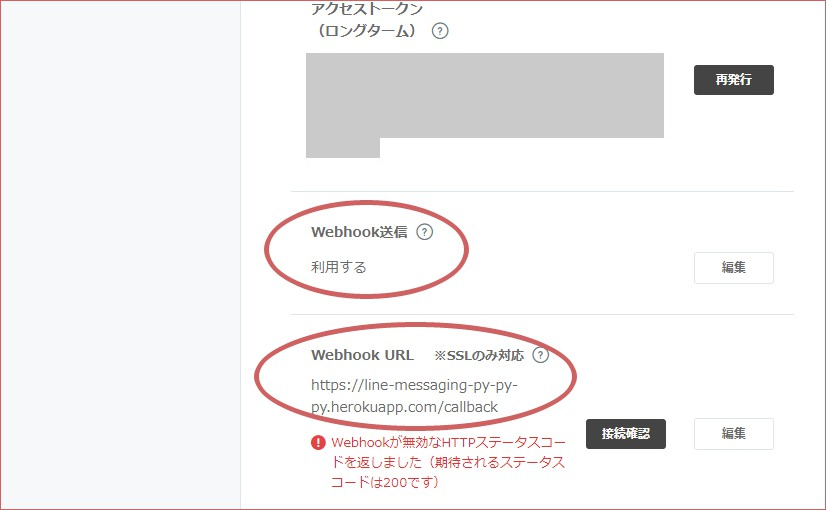


## 使ってみる(reply_message)

チャネル基本設定のページの下の方に QR コードがあるので、そこからこのチャネルを友達登録する。

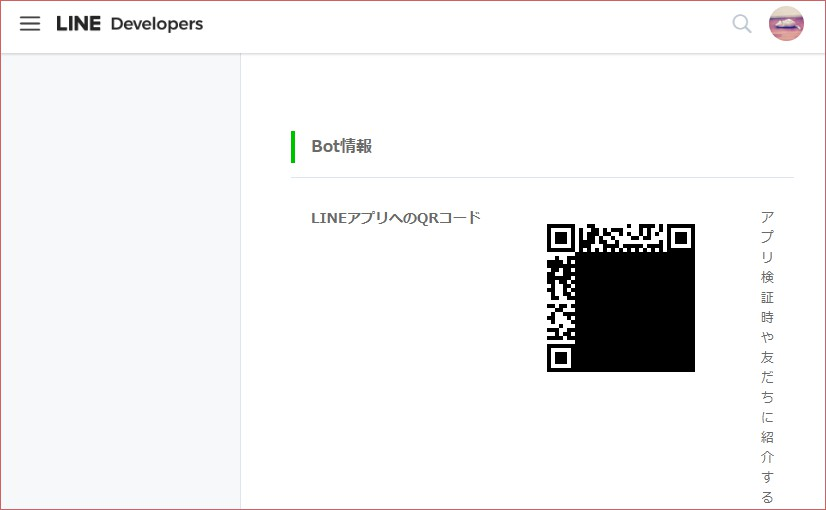

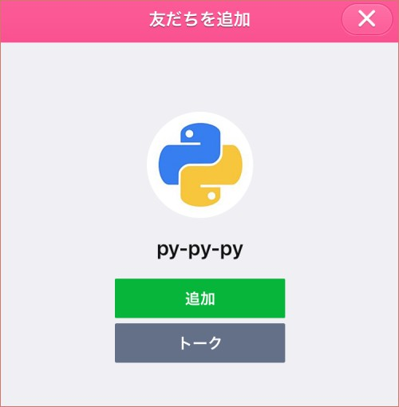

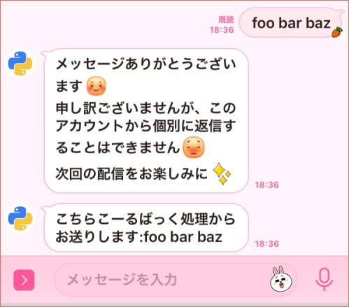

Python で書いたコールバック処理を通過してメッセージが返されたことがわかる。いまはチャネルの設定がデフォルトなので色々自動返信されちゃっているけれど、それはのちのち編集したらいい。


## event と userId の内容

my_flask_script.py では、 `app.logger.info` によって、このスクリプトへ送られてきた情報を出力している。 `heroku logs --tail` で確認できる。

```json
{
    "events": [
        {
            "type": "message",
            "replyToken": "********************************",
            "source": {
                "userId": "*********************************",
                "type": "user"
            },
            "timestamp": 1572247838104,
            "message": {
                "type": "text",
                "id": "**************",
                "text": "foo bar baz"
            }
        }
    ],
    "destination": "*********************************"
}
```

この中の `userId` はあとで push_message に使いたいので、控えておく。コード内で取得したい場合、以下のように取得する。

```python
event.source.user_id
```


## push_message を使う

上で書いた Python スクリプトだけでは、返事しかできない。そうではなく、サーバ側から能動的にメッセージを送れるようにしたい。それは上で控えた「アクセストークン」と「userId」を使用すればできる。もちろんこれは Heroku にアップする必要はなく、ローカルから試せる。

```python
from linebot import LineBotApi
from linebot.models import TextSendMessage

CHANNEL_ACCESS_TOKEN = '上で使った CHANNEL_ACCESS_TOKEN と同じ'
USER_ID = '上で控えた userId の値'

line_bot_api = LineBotApi(CHANNEL_ACCESS_TOKEN)

line_bot_api.push_message(
    USER_ID,
    TextSendMessage(text='ぷっしゅめっせーじです。やあ!'))
```

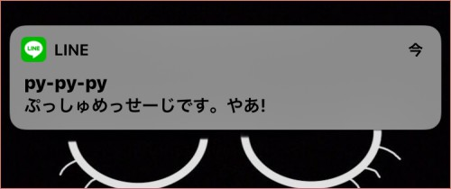

このとおり、ユーザごとにユニークである `user_id` をおさえておればいつでもメッセージを送付することができることがわかる。

