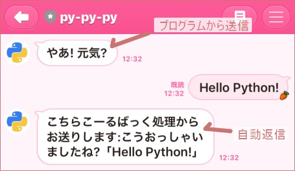
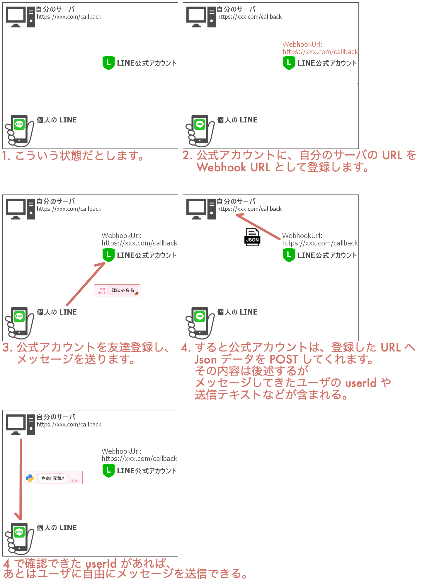

【LINE Messaging API】みんなの LINE へプログラムからメッセージを送りたい
===

## 概要

- 友達登録したユーザに個別にメッセージを送りたい。
- プログラムからそれを行いたい。



同じような内容のページはすでにネットにある。  
だけれど自分が持った次のような疑問に、ストレートに応えるページがあってもいいかな、と思い、同じような疑問をもつ誰かに刺さるよう記事をかく。

## もった疑問

- 「LINE プログラムからメッセージ送信」と調べてみたけれど、 LINE Notify とか LINE公式アカウントとか LINE@ とか出てきてようわからん。
- 送信をしたいだけなのに、ネットの記事をみると「さてサーバを用意しよう」と突然サーバが出てきて困惑。

ざっくり簡単に回答すると……

- 使うのは、 LINE公式アカウントを取得したあとに利用できる LINE Messaging API。
- 「送信する」のは自分のぱそこから(サーバなしで)出来るんだけれど、送信先を指定するためには送信先ユーザの ID が必要なんだ。それを取得するために、サーバが必要になってしまう。でも Heroku で無料で出来るから大丈夫。

## なぜ LINE Messaging API

「LINE Notify とか LINE公式アカウントとか LINE@ とか出てきてようわからん」に応える。

- **LINE Notify**
    - 自分か自分の含まれるグループへメッセージを送れる。
    - プログラムから送れる。
    - しかし友達へ個別に送ることはできなさそう。
- **LINE公式アカウント**
    - 公式アカウントを作ると、友達登録をしたユーザに一斉送付が出来る。個人メッセもできる。
    - しかしそれらはすべてブラウザから手打ちで、自動で個人にメッセすることはできないみたい。
- **LINE@**
    - 2018年の終わりに公式アカウントに統合された。コイツのことはもう忘れていい。
    - 参考: [【重要】LINE@サービス統合のお知らせ](http://blog-at.line.me/archives/52626249.html)
- **LINE Messaging API**
    - 公式アカウントの中に含まれる機能。
    - やりたいことができる。

というわけで、まず LINE公式アカウントを作成して、それから LINE Messaging API を利用することになる。

### 料金

[LINE公式アカウントとは丨料金紹介](https://www.linebiz.com/lp/line-official-account/plan/)に載っている。たぶん、自動返信については無料でいくらでも使えて、 push 機能(能動的送信。今回やりたいことのゴール)については1,000通まで無料で使える。


## これから作るものを図にして整理

図説するとこんな感じになる。図をみると、なんでサーバが必要になるのかわかると思う。



## チャネルを作成

各ユーザにメッセージを送るのは「LINE公式アカウント」ではない。「チャネル」なのだ。


この左側、会話相手は公式アカウントではなくチャネル。だからまず「LINE公式アカウント」を作って、その子要素の「プロバイダ」を作って、その子要素の「チャネル」を作ることになる。

- **LINE公式アカウント**
    - [https://developers.line.biz/](https://developers.line.biz/) からどうぞ。
- **プロバイダ**
    - 突然出てきた「プロバイダ」はアプリを提供する組織のことで、自分の名前や企業名を入力するものらしい。が、自分の名前は LINE公式アカウントに紐付いており自分の名前をここで使う違和感がある……。
- **チャネル**
    - LINE に表示させたい名前をつければいい。

### 新規チャネル作成まで

「LINE公式アカウント」と「プロバイダ」はすでに作った前提で進めてみる。


チャネルを作り、友達登録をしてしまえば、この時点で [https://manager.line.biz/](https://manager.line.biz/) 上で会話ができる。

### トークン類の取得

チャネル基本設定から、「Channel Secret」と「アクセストークン」を取得する。


## サーバを用意

上述したように、誰かにメッセージを自動送信するためにはそのユーザの ID が必要だ。ユーザの ID は、一度ユーザからチャネル宛にメッセージを送ってもらい、そのときチャネルが自分のサーバに送信してくれる Json の中から取得できる。次は、サーバに配置するウェブアプリを Python で作成する。


### Python スクリプトを作成

自分の場合、 pipenv を使うのでこんなふうに環境を準備。

```bash
pipenv install flask line-bot-sdk gunicorn
```

Python スクリプトは my_flask_script.py って名前にしてみた。ベースのコードは [line-bot-sdk のドキュメント](https://github.com/line/line-bot-sdk-python#synopsis)から取得し、そこへ手を加えた。

```python
from flask import Flask, request, abort

from linebot import (
    LineBotApi, WebhookHandler
)
from linebot.exceptions import (
    InvalidSignatureError
)
from linebot.models import (
    MessageEvent, TextMessage, TextSendMessage,
)

# 環境変数取得のため。
import os

# ログを出力するため。
import logging
import sys

app = Flask(__name__)

# ログを標準出力へ。heroku logs --tail で確認するためです。
# app.logger.info で出力するため、レベルは INFO にする。
app.logger.addHandler(logging.StreamHandler(sys.stdout))
app.logger.setLevel(logging.INFO)

# 大事な情報は環境変数から取得。
CHANNEL_ACCESS_TOKEN = os.environ['CHANNEL_ACCESS_TOKEN']
CHANNEL_SECRET = os.environ['CHANNEL_SECRET']

line_bot_api = LineBotApi(CHANNEL_ACCESS_TOKEN)
handler = WebhookHandler(CHANNEL_SECRET)


# 必須ではないけれど、サーバに上がったとき確認するためにトップページを追加しておきます。
@app.route('/')
def top_page():
    return 'Here is root page.'


# ユーザがメッセージを送信したとき、この URL へアクセスが行われます。
@app.route('/callback', methods=['POST'])
def callback_post():
    # get X-Line-Signature header value
    signature = request.headers['X-Line-Signature']

    # get request body as text
    body = request.get_data(as_text=True)
    app.logger.info('Request body: ' + body)

    # handle webhook body
    try:
        handler.handle(body, signature)
    except InvalidSignatureError:
        abort(400)

    return 'OK'


@handler.add(MessageEvent, message=TextMessage)
def reply_message(event):
    # reply のテスト。
    line_bot_api.reply_message(
        event.reply_token,
        TextSendMessage(text='こちらこーるばっく処理からお送りします:'+event.message.text))


if __name__ == '__main__':
    app.run()
```


### Heroku 用ファイル作成

```bash
# runtime.txt: Python のバージョンを記載。
echo python-3.7.4 > runtime.txt

# requirements.txt: 依存ライブラリの記載。
pip freeze > requirements.txt

# Procfile: プログラムの実行方法を記載。
echo web: gunicorn my_flask_script:app --log-file - > Procfile
```

Procfile は `web: python my_flask_script.py` ではなぜだか動かなかった。Procfile の `--log-file` はログを吐くオプション。 `-` は stdout を指す。これを設定することでのちに `heroku logs --tail` によるログ確認ができる。


### Heroku へアップ

Heroku のアカウントはすでに持っているという前提でざくざく進める。

```bash
# Git リポジトリ作成。
git init
# 個人的な趣味で、最初に空っぽのコミットを作成。
git commit --allow-empty -m "Initial Commit"
# 全ファイルをコミット。
git add --all
git commit -m "Add all files"

# 今回のアプリ名は line-messaging-py-py-py にしてみる。
heroku create line-messaging-py-py-py

# 環境変数を設定。
heroku config:set CHANNEL_ACCESS_TOKEN="チャネル基本設定のページからアクセストークンをコピーしてくる" --app line-messaging-py-py-py
heroku config:set CHANNEL_SECRET="チャネル基本設定のページから Channel Secret をコピーしてくる" --app line-messaging-py-py-py

# Heroku のリポジトリへアップ。
git push heroku master

# 途中でなにか失敗したら destroy で一度消し、 create からやりなおす。
# heroku apps:destroy --app line-messaging-py-py-py
```

トップページのメソッドも作ってあるので開いてみる。


アップが成功していることがわかる。


## Heroku URL をチャネルへ登録

チャネル基本設定のページで Webhook URL を登録し、 Webhook送信 を有効にする。上の Python スクリプトで、 callback を受け付ける URL は `/callback` にしたので、今回の Webhook URL は `https://line-messaging-py-py-py.herokuapp.com/callback` になる。

これはよくわからないのだけれど、「接続確認」をすると赤文字が出て我々を不安にさせる。だがこのまま進んでも問題なかった……。


## reply_message を使ってみる

チャネル基本設定のページの下の方に QR コードがあるので、そこからこのチャネルを友達登録する。


Python で書いたコールバック処理を通過してメッセージが返されたことがわかる。いまはチャネルの設定がデフォルトなので色々自動返信されちゃっているけれど、それはのちのち編集したらいい。


## event と userId の内容

my_flask_script.py では、 `app.logger.info` によって、このスクリプトへ送られてきた情報を出力している。 `heroku logs --tail` で確認できる。

```json
{
    "events": [
        {
            "type": "message",
            "replyToken": "********************************",
            "source": {
                "userId": "*********************************",
                "type": "user"
            },
            "timestamp": 1572247838104,
            "message": {
                "type": "text",
                "id": "**************",
                "text": "foo bar baz"
            }
        }
    ],
    "destination": "*********************************"
}
```

この中の `userId` はあとで push_message に使いたいので、控えておく。コード内で取得したい場合、以下のように取得する。

```python
event.source.user_id
```


## push_message を使ってみる

今回のゴールだ。上で控えた「アクセストークン」と「userId」を使用すれば能動的にメッセージ送信ができる。もちろんこれは Heroku にアップする必要はなく、ローカルから試せる。

```python
from linebot import LineBotApi
from linebot.models import TextSendMessage

CHANNEL_ACCESS_TOKEN = '上で使った CHANNEL_ACCESS_TOKEN と同じ'
USER_ID = '上で控えた userId の値'

line_bot_api = LineBotApi(CHANNEL_ACCESS_TOKEN)

line_bot_api.push_message(
    USER_ID,
    TextSendMessage(text='ぷっしゅめっせーじです。やあ!'))
```


このとおり、ユーザごとにユニークである `user_id` をおさえておればいつでもメッセージを送付することができることがわかる。おわり。長い記事になってしまった……。